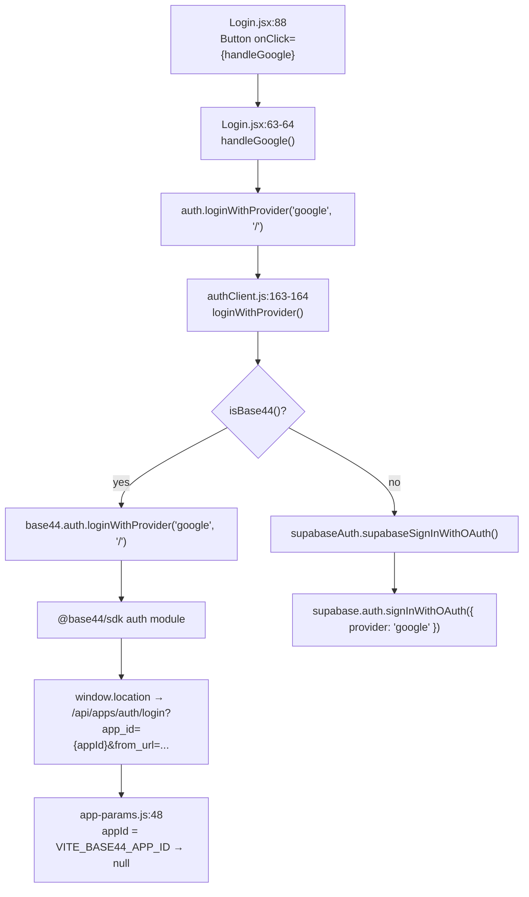
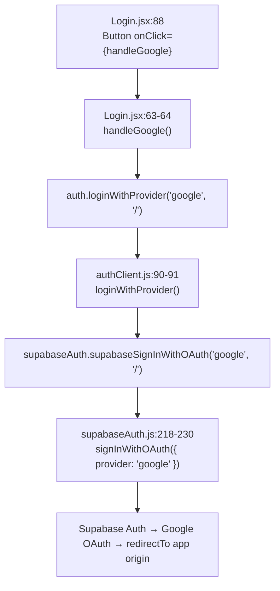

# Base44 Auth → Supabase Auth Migration Report

**Date:** 2026-07-06  
**Issue:** Production "Continue with Google" redirected to  
`https://www.boothbridge.app/api/apps/auth/login?app_id=null&from_url=...`  
(Base44 endpoint, not Supabase OAuth)

**Root cause:** `authClient.js` still delegated to `base44.auth.loginWithProvider()` when `VITE_DATA_BACKEND=base44` (or when the deployed bundle still contained the Base44 branch). With `VITE_BASE44_APP_ID` unset, `app_id=null` was passed into the Base44 SDK URL builder via `src/lib/app-params.js`.

---

## Call graph — Google button → `/api/apps/auth/login` (before fix)

**Production failure path:** `E → F → G → H` with `app_id=null`.

---

## Call graph — Google button (after fix)

No code path can reach `/api/apps/auth/login` from application auth anymore.

---

## Files with Base44 auth invocations (before migration)

| File | Lines | Symbol / pattern | Role |
|------|-------|------------------|------|
| `src/api/authClient.js` | 10 | `import { base44 } from base44Client` | Base44 SDK import |
| `src/api/authClient.js` | 11-12 | `createAxiosClient`, `isBase44` | Base44 helpers |
| `src/api/authClient.js` | 19-20 | `base44.auth.me()` | getCurrentUser |
| `src/api/authClient.js` | 23-30 | `base44CheckAppReady()` via `/api/apps/public` | App bootstrap |
| `src/api/authClient.js` | 33-38 | `base44.auth.me()` | isAuthenticated |
| `src/api/authClient.js` | 51-52 | `base44.auth.refresh()` | Session refresh |
| `src/api/authClient.js` | 65 | `base44.auth.loginViaEmailPassword` | Email login |
| `src/api/authClient.js` | 71-72 | `base44.auth.logout` | Logout |
| `src/api/authClient.js` | 82 | `base44.auth.register` | Registration |
| `src/api/authClient.js` | 107-108 | `base44.auth.resetPassword` | Password reset |
| `src/api/authClient.js` | 117-118 | `base44.auth.updatePassword` | Password update |
| `src/api/authClient.js` | 147-148 | `base44.auth.onAuthStateChange` | Auth listener |
| `src/api/authClient.js` | **164** | **`base44.auth.loginWithProvider`** | **OAuth (Google/LinkedIn) — production bug** |
| `src/api/authClient.js` | 192-199 | `base44.auth.verifyOtp` / `confirmSignUp` | OTP |
| `src/api/authClient.js` | 208-209 | `base44.auth.setToken` | Token handoff |
| `src/api/authClient.js` | 223-224 | `base44.auth.resendOtp` | Resend OTP |
| `src/api/authClient.js` | 232 | `base44.auth.resetPasswordRequest` | Forgot password |
| `src/api/authClient.js` | 237 | `base44.auth.updateMe` | Profile metadata |
| `src/api/authClient.js` | 242 | `base44.auth.redirectToLogin` | Login redirect |
| `src/api/authClient.js` | 253-254 | `base44.functions.invoke('adminAuth')` | Admin login |
| `src/lib/AuthContext.jsx` | 3-4 | `appParams`, `isSupabase` | Base44 token-gated bootstrap |
| `src/lib/AuthContext.jsx` | 63-70 | `appParams.token` branch | Base44-only session check |
| `src/lib/AuthContext.jsx` | 85-103 | Base44 error handling | Base44 403 reasons |
| `src/lib/AuthContext.jsx` | 115 | `if (!isSupabase()) return` | Skipped Supabase listener |
| `src/components/layout/AdminLayout.jsx` | 89-91 | `auth.isAdminSession()` | Base44 admin session |
| `src/components/layout/AdminLayout.jsx` | 161-166 | `clearAdminSession()` | Base44 admin logout |
| `src/api/supabaseClient.js` | 16-19 | `isSupabase()` gate | Blocked auth when `DATA_BACKEND=base44` |
| `src/lib/app-params.js` | 48, 50 | `app_id`, `from_url` | Fed Base44 SDK (`app_id=null`) |
| `src/api/base44Client.js` | 7-14 | `createClient({ appId, ... })` | SDK singleton (auth consumer) |
| `scripts/phase6/lib/base44-client.mjs` | 60 | `base44.auth.loginViaEmailPassword` | Archived export script only |

### Consumer pages (no direct Base44 — routed through `authClient`)

| File | Lines | Call |
|------|-------|------|
| `src/pages/Login.jsx` | 40 | `auth.loginWithEmailPassword` |
| `src/pages/Login.jsx` | **64, 68** | **`auth.loginWithProvider` (Google, LinkedIn)** |
| `src/pages/Register.jsx` | 33, 46, 48, 61, **72** | register, verifyOtp, setToken, resendOtp, loginWithProvider |
| `src/pages/ForgotPassword.jsx` | 19 | `auth.requestPasswordReset` |
| `src/pages/ResetPassword.jsx` | 28 | `auth.resetPassword` |
| `src/pages/AdminLogin.jsx` | 85 | `auth.adminLogin` |
| `src/pages/Onboarding.jsx` | 96, 116, 163, 187, 215 | getCurrentUser, updateUserMetadata |
| `src/pages/Profile.jsx` | 239 | `auth.logout` |
| `src/components/layout/AppLayout.jsx` | 193 | `auth.logout` |
| `src/components/layout/AdminLayout.jsx` | 158 | `auth.logout` |
| `src/lib/PageNotFound.jsx` | 14 | `auth.getCurrentUser` |
| `src/lib/AuthContext.jsx` | 18, 45, 52, 93, 95, 100, 117 | getCurrentUser, checkAppReady, isAuthenticated, logout, redirectToLogin, onAuthStateChange |

### Supabase implementation (target — unchanged)

| File | Lines | Symbol |
|------|-------|--------|
| `src/api/supabaseAuth.js` | 65-262 | All `supabase*` auth functions |
| `src/api/supabaseAuth.js` | **218-230** | **`supabaseSignInWithOAuth` → `signInWithOAuth`** |

### Non-auth Base44 (intentionally untouched)

| File | Purpose |
|------|---------|
| `src/utils/dbClient.js` | Data layer Base44 branch |
| `src/api/storageClient.js` | Storage Base44 branch |
| `src/api/aiClient.js`, `src/api/aiGateway.js` | AI Base44 branch |
| `vite.config.js` | `@base44/vite-plugin` (non-auth) |

---

## Replacements applied

### 1. `src/api/authClient.js` — full Supabase delegation

| Removed (Base44) | Replaced with (Supabase) |
|------------------|--------------------------|
| `base44.auth.me()` | `supabaseAuth.supabaseGetCurrentUser()` |
| `base44CheckAppReady()` / `/api/apps/public` | `supabaseAuth.supabaseCheckAppReady()` |
| `base44.auth.loginViaEmailPassword` | `supabaseAuth.supabaseLogin()` |
| `base44.auth.logout` | `supabaseAuth.supabaseLogout()` |
| `base44.auth.register` | `supabaseAuth.supabaseRegister()` |
| `base44.auth.resetPassword` | `supabaseAuth.supabaseCompletePasswordReset()` |
| `base44.auth.updatePassword` | `supabaseAuth.supabaseUpdatePassword()` |
| `base44.auth.onAuthStateChange` | `supabaseAuth.supabaseOnAuthStateChange()` |
| **`base44.auth.loginWithProvider`** | **`supabaseAuth.supabaseSignInWithOAuth()`** |
| `base44.auth.verifyOtp` / `confirmSignUp` | `supabaseAuth.supabaseVerifyOtp()` |
| `base44.auth.setToken` | `getSupabaseClient().auth.setSession()` |
| `base44.auth.resendOtp` | `supabaseAuth.supabaseResendOtp()` |
| `base44.auth.resetPasswordRequest` | `supabaseAuth.supabaseRequestPasswordReset()` |
| `base44.auth.updateMe` | `supabaseAuth.supabaseUpdateUserMetadata()` |
| `base44.auth.redirectToLogin` | `supabaseAuth.supabaseRedirectToLogin()` |
| `base44.functions.invoke('adminAuth')` | `supabaseAuth.supabaseAdminLogin()` |
| `isBase44()` branches (all) | Removed — no runtime branch |

### 2. `src/lib/AuthContext.jsx` — Supabase-only bootstrap

| Removed | Replaced with |
|---------|---------------|
| `appParams.token` gated user check | Always `auth.isAuthenticated()` then `checkUserAuth()` |
| Base44 403 / `user_not_registered` handling | Unified Supabase error path |
| `if (!isSupabase()) return` on listener | Always subscribe `auth.onAuthStateChange` |
| Imports: `appParams`, `isSupabase` | Removed |

### 3. `src/components/layout/AdminLayout.jsx` — role-based admin only

| Removed | Replaced with |
|---------|---------------|
| `auth.isAdminSession()` (Base44 sessionStorage) | `ADMIN_ROLES.has(user.role)` |
| `clearAdminSession()` + manual redirect logout | `auth.logout('/admin-login')` |
| `isSupabase()` conditionals | Removed |

### 4. `src/api/supabaseClient.js` — auth decoupled from data backend

| Before | After |
|--------|-------|
| `getSupabaseClient()` required `VITE_DATA_BACKEND=supabase` | Requires only `VITE_SUPABASE_URL` + `VITE_SUPABASE_ANON_KEY` |
| Auth blocked when `DATA_BACKEND=base44` | Auth works whenever Supabase env is configured |

---

## Verification

| Check | Result |
|-------|--------|
| `grep base44\.auth src/` | **0 runtime matches** (comment only in authClient header) |
| `npm run build` | **PASS** (exit 0) |
| Pages unchanged | Login/Register still call `auth.loginWithProvider` — now Supabase-backed |

---

## Production deployment checklist

1. Ensure Vercel (or host) has:
   - `VITE_SUPABASE_URL`
   - `VITE_SUPABASE_ANON_KEY`
   - `VITE_APP_URL=https://www.boothbridge.app` (OAuth redirect)
2. Remove or ignore `VITE_DATA_BACKEND=base44` for auth purposes (auth no longer reads it).
3. Remove `VITE_BASE44_*` from production (no longer used by auth).
4. In Supabase Dashboard → Authentication → URL Configuration:
   - Site URL: `https://www.boothbridge.app`
   - Redirect URLs: `https://www.boothbridge.app/**`
5. Google OAuth provider enabled in Supabase with correct client ID/secret.

---

## Remaining Base44 references (non-auth, out of scope)

- `src/api/base44Client.js` — used by db/storage/ai only
- `src/lib/app-params.js` — `app_id` / `from_url` still present for legacy SDK params (not used by auth)
- `scripts/phase6/lib/base44-client.mjs` — archived data-export script
- `vite.config.js` — `@base44/vite-plugin` (does not affect auth after this change)
