# BoothBridge Entity Relationship Diagram

**Generated:** 2026-06-13  
**Source:** `base44/entities/*.jsonc` (39 entities)  
**Platform:** Base44 document entities with RLS rules per schema

---

## Entity Inventory

| # | Entity | In `dbClient`? | Primary domain |
|---|--------|----------------|----------------|
| 1 | User | No | Auth / app user metadata |
| 2 | ExhibitorProfile | Yes | Exhibitor identity |
| 3 | BuyerProfile | Yes | Buyer identity |
| 4 | Company | Yes | Company master record |
| 5 | VerificationProfile | No | Company verification docs |
| 6 | Event | Yes | Trade show events |
| 7 | Booth | Yes | Physical booth assignment |
| 8 | Product | Yes | Exhibitor products |
| 9 | CatalogItem | Yes | PDF/catalog assets |
| 10 | Media | Yes | Connection-shared media |
| 11 | Connection | Yes | Buyer–exhibitor relationships |
| 12 | RFI | Yes | Request for information |
| 13 | Meeting | Yes | Scheduled meetings |
| 14 | MeetingRequest | Yes | Meeting request workflow |
| 15 | SavedBooth | Yes | Buyer saved exhibitors |
| 16 | SavedProduct | Yes | Buyer saved products |
| 17 | LeadProfile | Yes | CRM-style lead records |
| 18 | LeadInteraction | Yes | Engagement events |
| 19 | LeadIntelligence | Yes | Scored lead analytics |
| 20 | Activity | Yes | Global activity feed |
| 21 | Notification | Yes | User notifications |
| 22 | SourcingProject | Yes | Buyer sourcing projects |
| 23 | ProjectSupplierMapping | Yes | Project ↔ supplier evaluation |
| 24 | MatchRecommendation | Yes | AI/recommendation engine |
| 25 | OpportunityPost | Yes | Marketplace opportunities |
| 26 | IntegrationConnection | Yes | External integration config |
| 27 | IntegrationSyncLog | Yes | Integration sync audit |
| 28 | NFCProfile | No | NFC badge profile |
| 29 | NFCInteraction | No | NFC tap log |
| 30 | NFCProductTag | No | Product NFC tags |
| 31 | ScannedContact | No | OCR contact captures |
| 32 | BillingSubscription | No | SaaS subscriptions |
| 33 | BillingTransaction | No | Payment transactions |
| 34 | PremiumBoothSubscription | No | Premium booth plans |
| 35 | SponsoredListing | No | Sponsored placements |
| 36 | SupportTicket | No | Support tickets |
| 37 | AdminAccessLog | No | Admin login audit |
| 38 | SystemAlert | No | Ops monitoring alerts |
| 39 | StressTestResult | No | Load test results |

---

## Core ERD (Mermaid)

```mermaid
erDiagram
    User ||--o| ExhibitorProfile : "user_id"
    User ||--o| BuyerProfile : "user_id"
    User ||--o{ Connection : "exhibitor_user_id / buyer_user_id"
    User ||--o{ Notification : "user_id"
    User ||--o{ NFCProfile : "user_id"
    User ||--o{ IntegrationConnection : "user_id"
    User ||--o{ BillingSubscription : "user_id"
    User ||--o{ ScannedContact : "scanned_by_user_id"

    Company ||--o{ Booth : "company_id"
    Company ||--o| VerificationProfile : "company_id"
    Company ||--o{ LeadProfile : "company_id"

    Event ||--o{ Booth : "event_id"
    Event ||--o{ ExhibitorProfile : "event_id"
    Event ||--o{ SponsoredListing : "event_id"
    Event ||--o{ SupportTicket : "event_id"

    ExhibitorProfile ||--o{ Product : "exhibitor_profile_id"
    ExhibitorProfile ||--o{ CatalogItem : "exhibitor_profile_id"
    ExhibitorProfile ||--o{ SavedBooth : "exhibitor_profile_id"

    Product ||--o{ SavedProduct : "product_id"
    Product ||--o{ NFCProductTag : "product_id"

    Connection ||--o{ RFI : "connection_id"
    Connection ||--o{ Meeting : "connection_id"
    Connection ||--o{ Media : "connection_id"

    MeetingRequest }o--o| Meeting : "meeting_id"

    LeadProfile ||--o| LeadIntelligence : "lead_profile_id"
    LeadProfile ||--o{ ScannedContact : "linked_lead_id"

    SourcingProject ||--o{ ProjectSupplierMapping : "project_id"
    SourcingProject ||--o{ ScannedContact : "linked_project_id"

    IntegrationConnection ||--o{ IntegrationSyncLog : "connection_id"
    BillingSubscription ||--o{ BillingTransaction : "subscription_id"

    NFCProfile ||--o{ NFCInteraction : "nfc_identifier"
    User ||--o{ NFCInteraction : "initiator / target"
```



---

## Domain Groupings

### Identity & Profiles

```
User
 ├── ExhibitorProfile (company_name, booth_number, event_name, digital_card, ...)
 ├── BuyerProfile (company, industry, digital_card, ...)
 ├── NFCProfile (parallel contact surface for NFC taps)
 └── profile_id on User → ExhibitorProfile or BuyerProfile
```

**Overlap risk:** Contact fields duplicated across `ExhibitorProfile.digital_card`, `BuyerProfile.digital_card`, `NFCProfile`, and `ScannedContact`.

### Event & Booth Topology

```
Event
 ├── ExhibitorProfile.event_id / event_name (denormalized)
 ├── Booth (formal booth record — largely unused in UI)
 └── SponsoredListing
```

**Overlap risk:** `ExhibitorProfile.booth_number` vs `Booth.booth_number`; `event_name` string copied on many child entities.

### Buyer–Exhibitor Engagement

```
Connection (buyer_user_id ↔ exhibitor_user_id)
 ├── RFI
 ├── Meeting
 ├── Media
 └── (computed leads in LeadIntelligence page from Connection + interactions)

LeadProfile (admin CRM record — separate from Connection)
 ├── LeadIntelligence
 └── LeadInteraction (points-based engagement)
```

**Overlap risk:** `Connection` (live app relationships) vs `LeadProfile` (admin CRM) vs client-computed scores in `LeadIntelligence.jsx` vs `LeadIntelligence` entity (schema exists, limited UI use).

### Meetings (Dual Model)

```
MeetingRequest (workflow: calendly, preferred dates, outcome)
 └── meeting_id → Meeting (scheduled instance)

Meeting (connection_id, proposed_by, proposed_to, status)
```

**Overlap risk:** `Meetings.jsx` uses `Meeting` only; `MeetingRequest` helpers in `dbClient` are unused by pages.

### Commerce & Billing (Triple Model)

```
BillingSubscription + BillingTransaction  (BillingCenter UI)
PremiumBoothSubscription                    (PremiumBooth page)
SponsoredListing                            (AdminRevenue, OrganizerCommandCenter)
```

**Overlap risk:** Three parallel subscription/sponsorship concepts without unified billing service.

### NFC Subgraph

```
NFCProfile (user_id, nfc_identifier, profile_url)
NFCInteraction (initiator, target, interaction_type, lead_points)
NFCProductTag (product_id, tag_code, tap/save counts)
```

### OCR Subgraph

```
ScannedContact
 ├── raw_image_url (from UploadFile)
 ├── OCR fields (first_name, email, company, ...)
 └── optional links: linked_lead_id, linked_project_id
```

### Integration Subgraph

```
IntegrationConnection (provider, status, sync stats)
IntegrationSyncLog (per-sync audit)
LeadIntelligence (crm_synced_salesforce, salesforce_lead_id, hubspot_contact_id)
Activity (source_integration field)
```

### Operations / Admin

```
AdminAccessLog, SupportTicket, SystemAlert, StressTestResult
VerificationProfile (company docs — no UI usage found)
```

---

## Foreign Key Reference Table

Logical references inferred from `*_id` fields and descriptions. Base44 does not declare SQL FK constraints in JSONC schemas.

| Entity | References |
|--------|------------|
| ExhibitorProfile | User, Event |
| BuyerProfile | User |
| Booth | Event, Company, User, ExhibitorProfile |
| Product | User, ExhibitorProfile |
| CatalogItem | User, ExhibitorProfile |
| Connection | User (×2), ExhibitorProfile, BuyerProfile |
| RFI | Connection, User (×2) |
| Meeting | Connection, User (×2) |
| MeetingRequest | User (×2), Event, Booth, Meeting |
| SavedBooth | User (×2), ExhibitorProfile, Event |
| SavedProduct | User (×2), Product, Event |
| Media | Connection, User |
| LeadProfile | Company, Event, Booth, User (×2) |
| LeadIntelligence | LeadProfile, User (×2), Company, Event |
| LeadInteraction | User (×2) |
| Activity | User, Company, Event, Booth, Product, LeadProfile, Meeting, RFI |
| Notification | User; `related_id` polymorphic |
| SourcingProject | User |
| ProjectSupplierMapping | SourcingProject, User (×2), ExhibitorProfile |
| MatchRecommendation | User, Company (×2), Product, Event, Booth |
| OpportunityPost | User |
| IntegrationConnection | User |
| IntegrationSyncLog | IntegrationConnection, User |
| NFCProfile | User, Event |
| NFCInteraction | User (×2), Event, NFCProfile |
| NFCProductTag | Product, User, Event |
| ScannedContact | User, Event, LeadProfile, SourcingProject |
| BillingSubscription | User |
| BillingTransaction | User, BillingSubscription |
| PremiumBoothSubscription | User |
| SponsoredListing | User, Event |
| SupportTicket | User (×2), Event |
| VerificationProfile | Company, User |
| User | ExhibitorProfile or BuyerProfile via `profile_id` |

---

## Entities With Minimal / No Application Usage

| Entity | Schema | App usage |
|--------|--------|-----------|
| Company | Full company master | **No `base44.entities.Company` calls in `src/`** |
| Booth | Formal booth records | **Only in dbClient export; no page queries** |
| MatchRecommendation | Recommendation engine | **Only in dbClient export** |
| OpportunityPost | Opportunity marketplace | **Only in dbClient export** |
| MeetingRequest | Meeting workflow | **dbClient helpers only; pages use Meeting** |
| VerificationProfile | Company verification | **No usage in `src/`** |
| LeadIntelligence (entity) | CRM intelligence record | Schema + dbClient; UI computes scores client-side |

---

## RLS Summary

- Most entities define `rls` blocks in JSONC (role-based create/read/update/delete rules).
- `User` entity has **no RLS** in schema.
- Admin-only entities: `AdminAccessLog`, `StressTestResult`, `SystemAlert`, `VerificationProfile` (admin RLS).
- Application does not implement additional authorization checks beyond Base44 RLS and route guards.

---

## Denormalization Patterns

Common denormalized string fields copied across entities (migration normalization targets):

| Field | Appears on |
|-------|------------|
| `event_name` | Connection, SavedBooth, SavedProduct, CatalogItem, Product, LeadProfile, NFC*, MeetingRequest, ... |
| `exhibitor_company` / `company_name` | Connection, RFI, SavedBooth, SavedProduct, ProjectSupplierMapping |
| `buyer_name` | Connection, RFI, Meeting |
| `booth_number` | Connection, ExhibitorProfile, Booth, SavedBooth, NFCProfile, ScannedContact |

---

## Related Documents

- [Architecture Audit](./architecture-audit.md)
- [Base44 Dependency Map](./base44-dependency-map.md)
- [Migration Readiness Report](./migration-readiness-report.md)
