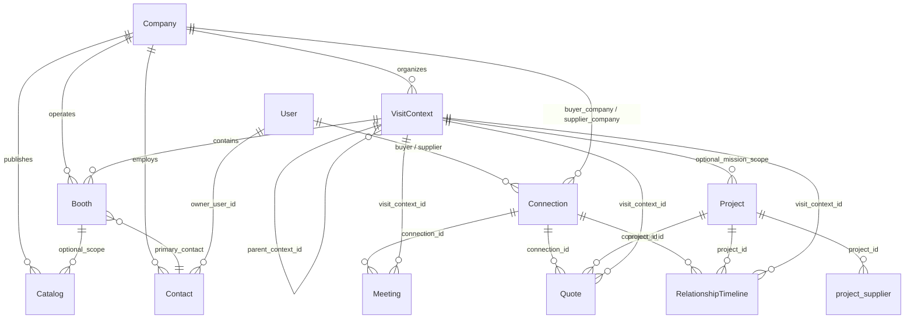

# BoothBridge Future Data Model

**Version:** 1.0  
**Date:** 2026-06-13  
**Status:** Design document (no code changes)  
**Audience:** Migration architects, product, backend engineers

---

## 1. Purpose

This document defines the **target business data model** for BoothBridge after migration to Supabase. It generalizes today’s trade-show-centric schema to support six commercial discovery contexts while preserving backward compatibility with the current React application, routes, and workflows.

### Supported business contexts

| Context | Description | Primary user motion |
|---------|-------------|---------------------|
| **Trade Shows** | Multi-exhibitor events with halls, booths, and fixed dates | Scan QR at booth → connect → RFI/meeting |
| **Yiwu Markets** | Permanent or semi-permanent district/stall markets | Navigate district → scan stall → save supplier |
| **Wholesale Markets** | Regional wholesale clusters (e.g. LA Fashion District) | Walk market → compare vendors → project sourcing |
| **Showrooms** | Appointment-based brand/showroom visits | Book visit → review catalog → quote |
| **Factory Visits** | On-site manufacturing audits and capability checks | Mission itinerary → factory check-in → quote |
| **Business Missions** | Organizer-led buyer delegations across multiple stops | Mission schedule → group visits → consolidated project |

The model centers on **where a commercial interaction happens** (`VisitContext`) and **who is engaging whom** (`Connection`, `Contact`, `RelationshipTimeline`), not on a single event type.

---

## 2. Design Principles

1. **Context-first** — Every scan, meeting, quote, and timeline entry attaches to a `VisitContext`.
2. **Company as anchor** — Legal/commercial identity lives on `Company`; users represent companies in a context.
3. **Connection as relationship** — Buyer–supplier links survive beyond a single show or visit.
4. **Timeline as narrative** — `RelationshipTimeline` unifies engagement history without replacing operational tables.
5. **Backward compatible** — Legacy entity names and fields remain available via views, enums, or `dbClient` aliases through Phase 4+.
6. **Progressive normalization** — Denormalized display fields (`event_name`, `company_name`) retained on hot paths during migration; trimmed later.

---

## 3. Core Entity Definitions

### 3.1 Company

**Purpose:** Canonical record for any organization — exhibitor, buyer, factory, market operator, mission organizer, or showroom host.

| Aspect | Detail |
|--------|--------|
| **Why it exists** | Today `company_name` is duplicated on `ExhibitorProfile`, `Connection`, `RFI`, and `ScannedContact`. A single company master enables cross-context supplier discovery and verification. |
| **Key attributes** | `id`, `company_name`, `legal_name`, `country`, `industry`, `website`, `logo_url`, `verification_status`, `company_type` (exhibitor, buyer, factory, market_operator, showroom, mission_organizer), `metadata` |
| **Owned by** | `created_by_user_id` (optional) |

**Reuse from current model:** `Company` entity (schema exists, unused in UI), fields from `ExhibitorProfile`, `VerificationProfile`.

---

### 3.2 Booth

**Purpose:** A **commercial presence point** within a visit context — trade show booth, Yiwu stall, wholesale unit, showroom suite, factory reception desk, or mission stop.

| Aspect | Detail |
|--------|--------|
| **Why it exists** | QR and NFC flows anchor on “visit this supplier at this place.” `Booth` is the scannable identity, not the company alone. |
| **Key attributes** | `id`, `visit_context_id`, `company_id`, `booth_number`, `label`, `hall`, `section`, `floor`, `coordinates`, `booth_type`, `is_premium`, `status`, `primary_contact_id`, `qr_payload`, `nfc_profile_id` |
| **Scannable** | `qr_payload` preserves `boothbridge:connect:{userId}:{role}` during transition; evolves to `boothbridge:booth:{boothId}` |

**Reuse from current model:** `Booth` entity, `ExhibitorProfile.booth_number`, `NFCProfile`, QR scan target resolution.

**Note:** A company may operate **multiple booths** across contexts (e.g. Canton Fair + Yiwu stall).

---

### 3.3 VisitContext

**Purpose:** **Where and when** commercial discovery occurs. Generalizes `Event` to all six business contexts.

| Aspect | Detail |
|--------|--------|
| **Why it exists** | Trade shows use `Event`; other contexts need the same abstraction (market district, factory tour day, mission itinerary). |
| **Key attributes** | `id`, `context_type`, `name`, `description`, `venue`, `city`, `country`, `timezone`, `start_date`, `end_date`, `status`, `organizer_company_id`, `parent_context_id`, `metadata` |
| **`context_type` enum** | `trade_show`, `yiwu_market`, `wholesale_market`, `showroom`, `factory_visit`, `business_mission` |

**Hierarchy examples:**

```
Business Mission (business_mission)
 └── Factory Visit stop (factory_visit) — parent_context_id → mission
Trade Show (trade_show)
 └── Hall / pavilion (optional child context)
Yiwu Market (yiwu_market)
 └── District (child) → Booths in district
```

**Reuse from current model:** `Event` → `VisitContext` where `context_type = trade_show`; `event_name` denormalization maps to `visit_context.name`.

---

### 3.4 Connection

**Purpose:** Persistent **buyer ↔ supplier** relationship, independent of a single visit.

| Aspect | Detail |
|--------|--------|
| **Why it exists** | Core app workflow: scan → connect → RFI → meeting. Must survive across multiple visit contexts. |
| **Key attributes** | `id`, `buyer_user_id`, `supplier_user_id`, `buyer_company_id`, `supplier_company_id`, `status`, `initiated_by`, `first_context_id`, `notes`, denormalized names for legacy UI |
| **Legacy fields preserved** | `exhibitor_user_id`, `buyer_user_id`, `exhibitor_company`, `buyer_name`, `booth_number`, `event_name` (computed or stored) |

**Reuse from current model:** `Connection` entity (direct 1:1 mapping).

---

### 3.5 Contact

**Purpose:** **Person-level** identity — card scans, badge taps, representatives, mission delegates.

| Aspect | Detail |
|--------|--------|
| **Why it exists** | Contact data is fragmented across `digital_card`, `NFCProfile`, `ScannedContact`, and `LeadProfile.lead_name`. |
| **Key attributes** | `id`, `owner_user_id`, `company_id`, `full_name`, `email`, `phone`, `mobile`, `whatsapp`, `linkedin`, `position`, `department`, `country`, `source` (ocr, nfc, manual, import), `raw_image_url`, `ocr_confidence`, `metadata` |
| **Links** | Optional `linked_user_id` if contact becomes a registered user |

**Reuse from current model:** `ScannedContact`, `ExhibitorProfile.digital_card`, `BuyerProfile.digital_card`, `NFCProfile` (display subset).

---

### 3.6 Catalog

**Purpose:** **Published commercial documents** — PDF catalogs, price lists, tech sheets, lookbooks — scoped to company and optionally to booth/context.

| Aspect | Detail |
|--------|--------|
| **Why it exists** | Renames and elevates `CatalogItem` to a first-class asset type aligned with `assetPipeline` storage paths. |
| **Key attributes** | `id`, `company_id`, `booth_id`, `visit_context_id`, `title`, `catalog_type`, `file_path`, `file_url`, `thumbnail_url`, `download_count`, `visibility`, `metadata` |
| **Storage** | `companies/{company_id}/catalogs/` and `events/{visit_context_id}/branding/` (existing pipeline) |

**Reuse from current model:** `CatalogItem` → `Catalog`; `Product` remains separate (SKU-level, not document-level).

---

### 3.7 Meeting

**Purpose:** Scheduled **synchronous interaction** between connected parties — on-site at booth, showroom appointment, factory walkthrough, or virtual.

| Aspect | Detail |
|--------|--------|
| **Why it exists** | Already operational in app (`Meeting` entity, `/meetings` route). |
| **Key attributes** | `id`, `connection_id`, `visit_context_id`, `booth_id`, `proposed_by`, `proposed_to`, `proposed_time`, `duration`, `status`, `location`, `meeting_type` (on_site, virtual, factory_tour, showroom), `title`, `metadata` |
| **Calendly / integrations** | Fields from `MeetingRequest` (calendly_url, outcome) fold in as optional columns or JSONB |

**Reuse from current model:** `Meeting` (direct); absorb useful fields from `MeetingRequest`.

---

### 3.8 Project

**Purpose:** Buyer **sourcing initiative** — compare suppliers, evaluate MOQ, certifications, and shortlist across contexts.

| Aspect | Detail |
|--------|--------|
| **Why it exists** | Replaces `SourcingProject` + `ProjectSupplierMapping` with clearer naming for wholesale/mission use cases. |
| **Key attributes** | `id`, `buyer_user_id`, `buyer_company_id`, `project_name`, `description`, `target_moq`, `required_certifications`, `target_countries`, `budget_range`, `deadline`, `status`, `visit_context_id` (optional — mission-scoped project), `metadata` |
| **Child records** | `project_supplier` (evaluation row per supplier; maps from `ProjectSupplierMapping`) |

**Reuse from current model:** `SourcingProject`, `ProjectSupplierMapping`, `/workspace/compare` flow.

---

### 3.9 Quote

**Purpose:** **Commercial ask or offer** — RFIs, price requests, sample requests, formal quotations.

| Aspect | Detail |
|--------|--------|
| **Why it exists** | Generalizes `RFI` for showroom/factory/wholesale workflows beyond “request for information.” |
| **Key attributes** | `id`, `connection_id`, `project_id`, `visit_context_id`, `booth_id`, `quote_type` (rfi, price, sample, moq, formal_quote), `message`, `reply`, `reply_attachment_url`, `status`, `buyer_user_id`, `supplier_user_id`, denormalized names |
| **Legacy** | `quote_type = rfi` + `connection_id` = current `RFI` row |

**Reuse from current model:** `RFI` → `Quote`; `/rfi-inbox`, `/my-rfis` unchanged at UI layer.

---

### 3.10 RelationshipTimeline

**Purpose:** **Append-only engagement history** for a connection or project — the narrative layer for lead intelligence and CRM sync.

| Aspect | Detail |
|--------|--------|
| **Why it exists** | Today scattered across `LeadInteraction`, `Activity`, `NFCInteraction`, notifications, and client-computed scores in `LeadIntelligence.jsx`. |
| **Key attributes** | `id`, `connection_id`, `project_id`, `visit_context_id`, `booth_id`, `actor_user_id`, `event_type`, `points`, `summary`, `source_module` (qr, nfc, ocr, meeting, quote, catalog, manual), `source_device`, `metadata`, `occurred_at` |
| **Not a replacement for** | Operational rows (meetings, quotes) — timeline **references** them via `metadata.related_id` |

**Reuse from current model:** `LeadInteraction`, `Activity`, `NFCInteraction` (ingested as timeline events).

---

## 4. Entity Relationship Model

### 4.1 Core ERD (future Supabase)



### 4.2 Context-specific mapping

| Business context | VisitContext type | Booth meaning | Typical Quote type |
|------------------|-------------------|---------------|-------------------|
| Trade Shows | `trade_show` | Exhibition booth | `rfi`, `sample` |
| Yiwu Markets | `yiwu_market` | Stall / shop unit | `price`, `moq` |
| Wholesale Markets | `wholesale_market` | Vendor unit | `price`, `formal_quote` |
| Showrooms | `showroom` | Showroom suite | `sample`, `formal_quote` |
| Factory Visits | `factory_visit` | Factory gate / reception | `moq`, `formal_quote` |
| Business Missions | `business_mission` | Mission stop (may link child factory/showroom contexts) | `rfi`, `formal_quote` |

### 4.3 Supporting entities (retained, not in core ten)

These remain outside the core ten but stay in the schema for app compatibility:

| Entity | Role in future model |
|--------|---------------------|
| `User` | Auth identity; links to Contact and role profiles |
| `ExhibitorProfile` / `BuyerProfile` | **Legacy views** over User + Company + Booth participation |
| `Product` | SKU-level listings (not merged into Catalog) |
| `SavedBooth` / `SavedProduct` | Buyer bookmarks; reference `booth_id` / `product_id` |
| `Notification` | Unchanged delivery layer |
| `NFCProfile` / `NFCInteraction` | Hardware tap layer; generates RelationshipTimeline events |
| `LeadIntelligence` | **Materialized view** or computed from RelationshipTimeline + Quote + Meeting |
| `IntegrationConnection` / `IntegrationSyncLog` | Unchanged |
| Billing / admin / ops entities | Unchanged |

---

## 5. Reuse Matrix (current → future)

| Future entity | Reuse directly | Adapt / extend |
|---------------|----------------|----------------|
| **Company** | Schema exists | Wire UI; link ExhibitorProfile companies |
| **Booth** | Schema exists | Attach to VisitContext; power QR/NFC |
| **VisitContext** | **New** | Migrate from `Event` |
| **Connection** | Full reuse | Add `company_id` FKs; keep legacy columns |
| **Contact** | **New table** | Import from ScannedContact + digital_card JSON |
| **Catalog** | Rename from CatalogItem | Same columns + `company_id` FK |
| **Meeting** | Full reuse | Add `visit_context_id`, `booth_id` |
| **Project** | Rename from SourcingProject | Child: project_supplier |
| **Quote** | Migrate from RFI | Add `quote_type` enum |
| **RelationshipTimeline** | **New table** | Backfill from Activity + LeadInteraction + NFCInteraction |

---

## 6. Merge Recommendations

### 6.1 Recommended merges

| Merge | Rationale | Compatibility approach |
|-------|-----------|------------------------|
| **Event → VisitContext** | Single abstraction for all six contexts | `visit_context` table; view `event` filtering `context_type = trade_show`; `db.Event` alias |
| **CatalogItem → Catalog** | Clearer domain name | View `catalog_item` → `catalog`; same IDs |
| **RFI → Quote** | RFIs are one quote type | View `rfi` where `quote_type = 'rfi'`; `/rfi-inbox` unchanged |
| **SourcingProject + ProjectSupplierMapping → Project + project_supplier** | One project model | Views with old names; `db.SourcingProject` alias in dbClient |
| **ScannedContact + digital_card + NFCProfile (contact fields) → Contact** | One person model | `scanned_contact` view; OCR/NFC pages read Contact |
| **LeadInteraction + Activity + NFCInteraction → RelationshipTimeline** | One timeline | Legacy tables kept read-only; dual-write during transition |
| **MeetingRequest → Meeting** | MeetingRequest unused in UI | Fold calendly/outcome fields into Meeting; deprecate table |
| **LeadProfile → Connection + Contact + RelationshipTimeline** | CRM lead = relationship + person + history | Admin leads UI reads view `lead_profile_compat` |
| **LeadIntelligence (entity) → computed layer** | UI already computes scores client-side | Materialized view or edge function; keep entity name as view |

### 6.2 Do not merge (keep separate)

| Pair | Reason |
|------|--------|
| **Catalog vs Product** | Documents vs SKU listings — different lifecycles |
| **Company vs Connection** | Organization vs relationship — many-to-many over time |
| **Booth vs Company** | One company, many booths/contexts |
| **Contact vs User** | Not every contact registers; GDPR/export differs |
| **Quote vs Meeting** | Async commercial ask vs scheduled sync interaction |
| **VisitContext vs Project** | Place/time vs buyer initiative — mission may link both |

### 6.3 Billing consolidation (parallel track)

| Current | Future |
|---------|--------|
| `BillingSubscription` + `PremiumBoothSubscription` | `subscription` with `plan_category` |
| `SponsoredListing` | `booth` + `visibility_tier` or `listing` child of Booth |

Not part of core ten; merge in finance phase after core migration.

---

## 7. Supabase ERD Recommendations

### 7.1 Table naming

Use **snake_case** plural table names (aligns with `ENTITY_TABLE_MAP` in `dbClient.js`):

| Future entity | Postgres table | Notes |
|---------------|----------------|-------|
| Company | `company` | |
| Booth | `booth` | |
| VisitContext | `visit_context` | |
| Connection | `connection` | |
| Contact | `contact` | |
| Catalog | `catalog` | was `catalog_item` |
| Meeting | `meeting` | |
| Project | `project` | was `sourcing_project` |
| project_supplier | `project_supplier` | was `project_supplier_mapping` |
| Quote | `quote` | was `rfi` |
| RelationshipTimeline | `relationship_timeline` | |

### 7.2 Critical indexes

```text
visit_context (context_type, start_date)
booth (visit_context_id, company_id)
booth (qr_payload) UNIQUE where qr_payload IS NOT NULL
connection (buyer_user_id, supplier_user_id) UNIQUE
connection (supplier_user_id, status)
quote (connection_id, status)
quote (quote_type, created_at)
meeting (proposed_to, proposed_time)
relationship_timeline (connection_id, occurred_at DESC)
relationship_timeline (visit_context_id, occurred_at DESC)
project (buyer_user_id, status)
project_supplier (project_id, supplier_user_id)
contact (owner_user_id, company_id)
catalog (company_id, visit_context_id)
```

### 7.3 RLS strategy (high level)

| Table | Policy pattern |
|-------|----------------|
| `connection` | Buyer or supplier user can read/write own rows |
| `quote` | Buyer and supplier on parent connection |
| `meeting` | Proposer and recipient |
| `project` | Owner buyer + invited suppliers (via project_supplier) |
| `relationship_timeline` | Same as connection read; append by participants |
| `contact` | Owner user; supplier sees contacts shared via connection |
| `catalog` | Public read if booth visible; write by company members |
| `booth` | Public read within active visit_context; write by company admin |
| `visit_context` | Public read for published contexts; write by organizer |

### 7.4 Realtime channels

Preserve current app behavior:

| Table | Channel use |
|-------|-------------|
| `connection` | Connections page live updates |
| `meeting` | Meetings page status changes |

### 7.5 Storage buckets (unchanged from assetPipeline)

```text
boothbridge-assets/
  events/{visit_context_id}/branding/
  companies/{company_id}/catalogs/
boothbridge-media/
  uploads/{user_id}/
boothbridge-ocr/
  scans/{user_id}/
```

### 7.6 Compatibility views (backward compatibility)

Create Postgres **views** so Phase 4 `dbClient` can query legacy names without page changes:

| View name | Maps to |
|-----------|---------|
| `event` | `visit_context WHERE context_type = 'trade_show'` |
| `catalog_item` | `catalog` |
| `rfi` | `quote WHERE quote_type = 'rfi'` |
| `sourcing_project` | `project` |
| `project_supplier_mapping` | `project_supplier` |
| `exhibitor_profile` | Join User + Company + Booth + VisitContext (computed) |
| `buyer_profile` | Join User + Contact + Company (computed) |
| `lead_interaction` | Subset of `relationship_timeline` |
| `activity` | Subset of `relationship_timeline` |

---

## 8. Backward Compatibility Plan

### 8.1 Application layer (no route/UI changes)

| Current app concept | Future backing | How compatibility is preserved |
|--------------------|----------------|--------------------------------|
| `/events` | `visit_context` (trade_show) | View `event`; filter unchanged |
| `/scan` QR payload | `booth` or user id | Resolver: user id → default booth for context |
| `/nfc/:userId` | `Contact` + `NFCProfile` | URL unchanged; profile from Contact |
| `/rfi-inbox`, `/my-rfis` | `quote` where type=rfi | View `rfi`; dbClient `db.RFI` → view |
| `/workspace/compare` | `project` + `project_supplier` | dbClient aliases |
| `/connections` | `connection` | Same table, added FKs nullable |
| `/meetings` | `meeting` | Same table + optional context FKs |
| `/ocr-scanner`, `/contacts` | `contact` | Import path from ScannedContact |
| Lead Intelligence page | `relationship_timeline` + client scoring | Timeline feeds existing `leadScoring.js` |
| Offline sync queues | `connection`, `quote`, `saved_booth`, etc. | Payload shapes unchanged; IDs stable |

### 8.2 dbClient alias strategy (Phase 4+)

Keep existing export names on `db` object:

```text
db.Event          → visit_context (filtered) or view event
db.RFI            → view rfi / quote filter
db.CatalogItem    → catalog
db.SourcingProject → project
db.ProjectSupplierMapping → project_supplier
db.ScannedContact → contact (source=ocr)
db.LeadInteraction → relationship_timeline (subset)
db.Activity       → relationship_timeline (subset)
```

Pages require **no import changes** if dbClient maps legacy names to views.

### 8.3 ID preservation

- Migrate with **same UUIDs** for Connection, Meeting, Quote (RFI), Project, Catalog, Booth, Company.
- `visit_context.id` = `event.id` for trade shows.
- Denormalized strings (`event_name`, `exhibitor_company`) populated on migration for read paths that still expect them.

### 8.4 NFC / QR / OCR / offline (frozen interfaces)

| Feature | Constraint |
|---------|------------|
| QR format | Keep `boothbridge:connect:{userId}:{role}` until booth-scoped payload rollout |
| NFC URL | Keep `/nfc/:userId` |
| OCR pipeline | Still writes Contact; `scanned_contact` view for old queries |
| Offline queues | Same action types; sync targets Connection, Quote, SavedBooth — table names via dbClient only |

---

## 9. Migration Phasing (data model only)

| Phase | Data model work |
|-------|-----------------|
| **Phase 3 (Supabase provision)** | Create core ten tables + legacy compatibility views |
| **Phase 4 (dbClient Supabase)** | Map entities to tables/views; nullable new FKs |
| **Phase 6 (data import)** | Event→VisitContext; RFI→Quote; backfill RelationshipTimeline from Activity |
| **Post-cutover** | Activate Company+Booth in UI; expand to Yiwu/wholesale context types |
| **Future product** | Business mission parent contexts; factory_visit scheduling |

---

## 10. Example: Business Mission Flow

```text
1. Organizer creates VisitContext (business_mission, "EU Buyers Yiwu 2026")
2. Child contexts: yiwu_market district, factory_visit stops
3. Booths registered under each child context (stall A12, Factory ShenZhen)
4. Buyer scans booth QR → Connection created (first_context_id = mission)
5. RelationshipTimeline: qr_scan, catalog_download events
6. Buyer creates Project ("Home decor Q3 sourcing") scoped to mission
7. project_supplier rows link evaluated booths/companies
8. Quote (price request) sent on Connection; appears in /my-rfis as RFI
9. Meeting scheduled at factory_visit context
10. Lead Intelligence reads timeline + quotes + meetings (unchanged UI)
```

---

## 11. Open Decisions (for product sign-off)

| Decision | Options | Recommendation |
|----------|---------|----------------|
| Booth QR payload | User id vs Booth id | Booth id long-term; user id during transition |
| ExhibitorProfile fate | View vs table | View after Company+Booth wired |
| LeadProfile in admin | Keep table vs view | View over Connection+Contact |
| VisitContext hierarchy depth | 1 vs 2 levels | 2 levels (mission → stop) |
| Quote vs formal invoice | Quote only vs Invoice entity | Quote only in v1; invoice in finance phase |

---

## 12. Related Documents

- [Entity Relationship Diagram (current)](./entity-relationship-diagram.md)
- [Migration Execution Roadmap](./migration-execution-roadmap.md)
- [Phase 1 Foundation Report](./phase1-foundation-report.md)
- [Architecture Audit](./architecture-audit.md)
