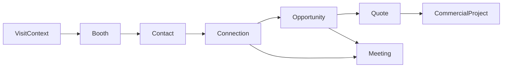
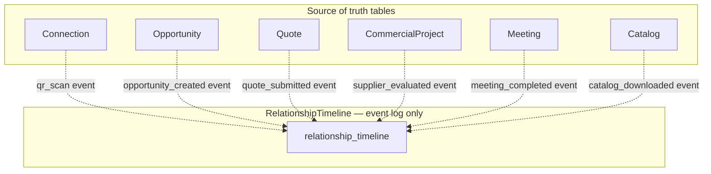
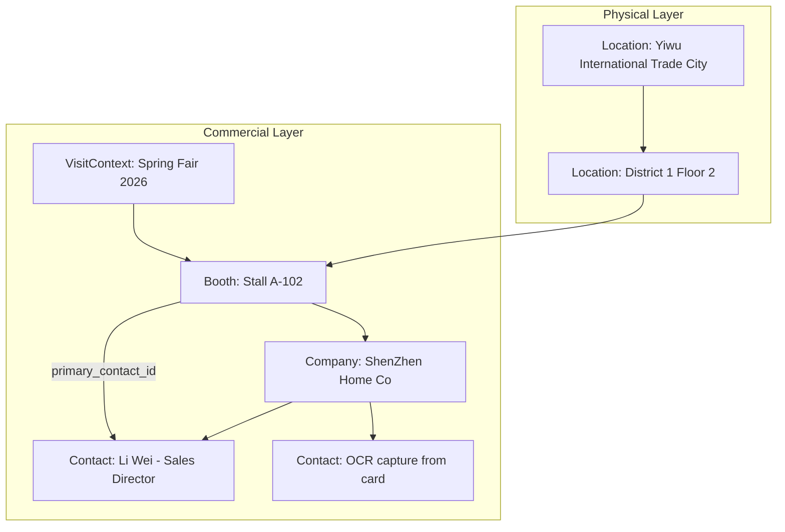
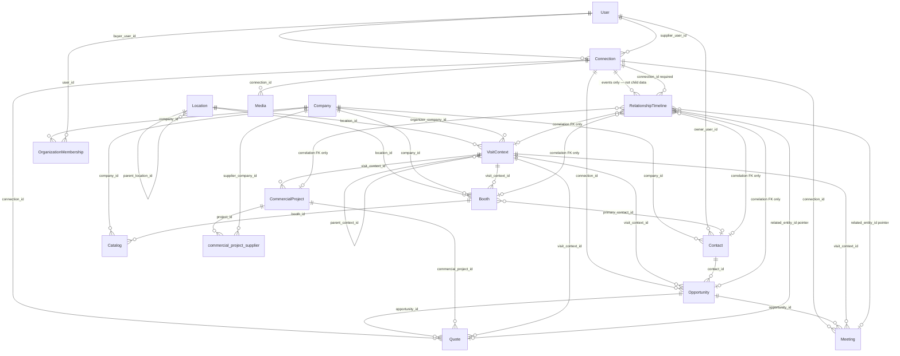

# BoothBridge Future ERD v2

**Version:** 2.1  
**Date:** 2026-06-13  
**Status:** Design document (no code changes)  
**Builds on:** [future-data-model.md](./future-data-model.md) v1.0  
**Audience:** Migration architects, product, backend engineers

---

## 1. Document Purpose

ERD v2 is the **long-term Supabase data architecture** for BoothBridge. It extends v1 with:

- Two additional visit types: **Distributor Visits** and **Supplier Visits**
- Explicit **Location** hierarchy (physical geography independent of commercial events)
- **OrganizationMembership** (users ↔ companies)
- **Opportunity** as a first-class pipeline stage between Connection and Quote
- **CommercialProject** (renamed from Project) for buyer sourcing initiatives
- Full entity specifications, business rules, Supabase implementation guidance, and migration complexity classification

**Constraint:** Preserve all current routes, QR/NFC/OCR flows, offline sync payloads, and `dbClient` legacy aliases.

---

## 2. Supported Business Contexts

| Context | `visit_context.context_type` | Booth role | Typical lifecycle entry |
|---------|------------------------------|--------------|-------------------------|
| **Trade Shows** | `trade_show` | Exhibition booth | QR scan at booth |
| **Yiwu Markets** | `yiwu_market` | Stall / shop unit | District navigation → stall scan |
| **Wholesale Markets** | `wholesale_market` | Vendor unit | Market walk → save vendor |
| **Permanent Showrooms** | `permanent_showroom` | Showroom suite (always open) | Appointment → catalog review |
| **Factory Visits** | `factory_visit` | Factory reception / line entry | Mission check-in |
| **Business Missions** | `business_mission` | Mission stop (parent context) | Delegation itinerary |
| **Distributor Visits** | `distributor_visit` | Distributor warehouse / office | Partner audit → opportunity |
| **Supplier Visits** | `supplier_visit` | Supplier facility desk | Buyer outbound visit → quote |

`VisitContext` remains the **temporal/commercial frame**; `Location` is the **physical place** that may host many contexts over time (e.g. Yiwu District 1 is a Location; each trade fair week is a VisitContext).

---

## 3. Architecture Overview

### 3.1 Physical hierarchy

```text
Location (geography — persistent)
 └── Booth (commercial presence point — scannable)
      └── Company (legal/commercial org operating the booth)
           └── Contact (people representing the company)
```

### 3.2 Relationship lifecycle (operational entities)

```text
VisitContext (when/why discovery happens)
 → Booth (where scan/tap occurs)
 → Contact (who was met — optional at connect time)
 → Connection (persistent buyer ↔ supplier link)
 → Opportunity (qualified commercial intent)
 → Quote (formal ask: RFI, price, sample, MOQ)
 → CommercialProject (structured sourcing initiative)
```

Meetings and Catalog downloads **branch from** Connection/Opportunity at any stage.

**RelationshipTimeline is not part of this chain.** It is a parallel **event stream** that records *that something happened* — it does not replace, copy, or supersede Meeting, Quote, Opportunity, or CommercialProject rows. See §3.3.

### 3.3 RelationshipTimeline — event stream, not source of truth

| Principle | Rule |
|-----------|------|
| **Single source of truth** | Meeting status/time, Quote message/reply, Opportunity stage/value, and CommercialProject evaluation fields live **only** on their respective tables. |
| **Timeline role** | Append-only **activity log**: `event_type`, short `summary`, `occurred_at`, `actor_user_id`, optional `points`, and **pointers** (`related_entity_type`, `related_entity_id`) to the canonical row. |
| **No duplication** | Timeline rows must **not** store quote body, meeting schedule, opportunity probability, project MOQ targets, or mutable business state. |
| **Write pattern** | Application or DB trigger: **write operational row first** → insert Timeline event referencing that row's id. |
| **Read pattern** | UI lists meetings/quotes/projects from operational tables; timeline feeds analytics, lead scoring, CRM activity feeds, and admin audit. |
| **FKs on timeline** | `opportunity_id`, `commercial_project_id`, etc. are **correlation keys** for filtering the stream — not authoritative copies of those entities. |

```text
                    ┌─────────────────────────────────────┐
                    │     RelationshipTimeline            │
                    │  (event stream — NOT source of      │
                    │   truth for operational data)       │
                    └──────────▲──────────────────────────┘
                               │ emits events (pointers only)
     Connection ──► Opportunity ──► Quote ──► CommercialProject
           │              │           │
           └──► Meeting ──┴───────────┘
           └──► Catalog download (catalog row is source of truth)
```

---

## 4. Core Entity Specifications

### 4.1 Location

| | |
|--|--|
| **Purpose** | Persistent **geographic anchor** — venue, market district, industrial park, showroom building, factory campus. Survives individual events and supports multi-context reuse. |
| **Primary fields** | `id`, `name`, `location_type` (venue, district, building, campus, city_zone), `address_line`, `city`, `state`, `country`, `postal_code`, `latitude`, `longitude`, `timezone`, `parent_location_id`, `metadata`, `created_at`, `updated_at` |
| **Relationships** | `parent_location_id` → Location; 1:N → Booth; 1:N → VisitContext (optional `location_id`); N:1 → Company (operator, optional) |
| **Business rules** | • Location does not expire when a trade show ends.<br>• Booth must reference exactly one Location.<br>• Coordinates optional but recommended for map/discovery.<br>• Deleting a Location with active Booths is blocked. |

**Maps from current:** Partially new; `Event.venue`, `Event.city`, `ExhibitorProfile` address fields denormalize into Location on migration.

---

### 4.2 Company

| | |
|--|--|
| **Purpose** | Canonical **organization** — exhibitor, buyer, factory, distributor, market operator, mission organizer. |
| **Primary fields** | `id`, `company_name`, `legal_name`, `company_type` (exhibitor, buyer, factory, distributor, wholesaler, market_operator, mission_organizer, showroom_host), `country`, `industry`, `sub_industry`, `website`, `logo_url`, `verification_status`, `trust_score`, `is_active`, `created_by_user_id`, `metadata`, `created_at`, `updated_at` |
| **Relationships** | 1:N → Booth; 1:N → Contact; 1:N → Catalog; 1:N → OrganizationMembership; 1:1 → VerificationProfile (supporting); N:M → Connection (as buyer or supplier company) |
| **Business rules** | • `company_name` required; unique per country optional (product decision).<br>• One user may belong to multiple companies via OrganizationMembership.<br>• Supplier and buyer can be the same company_id in different Connection roles (rare, allowed). |

**Maps from current:** **Reuse As-Is** schema + wire UI; absorb `ExhibitorProfile.company_name`.

---

### 4.3 Booth

| | |
|--|--|
| **Purpose** | **Scannable commercial presence** at a Location within a VisitContext — booth, stall, suite, factory gate, distributor desk. |
| **Primary fields** | `id`, `location_id`, `visit_context_id`, `company_id`, `booth_number`, `label`, `hall`, `section`, `floor`, `coordinates_x`, `coordinates_y`, `booth_type`, `status` (draft, active, inactive), `is_premium`, `visibility_tier`, `primary_contact_id`, `qr_payload`, `nfc_profile_id`, `representative_user_id`, `metadata`, `created_at`, `updated_at` |
| **Relationships** | N:1 → Location; N:1 → VisitContext; N:1 → Company; N:1 → Contact (primary); 1:N → Catalog; optional Timeline **correlation** via `booth_id`; referenced by Quote, Meeting, Opportunity |
| **Business rules** | • QR scan resolves to Booth (or legacy user id → default booth lookup).<br>• `qr_payload` unique when not null.<br>• Company may operate multiple Booths in same VisitContext (e.g. hall + outdoor).<br>• Inactive booths reject new Connections but preserve history. |

**Maps from current:** **Adapt** — schema exists; add `location_id`, wire to VisitContext; merge `ExhibitorProfile.booth_number`, `SponsoredListing.placement`.

---

### 4.4 VisitContext

| | |
|--|--|
| **Purpose** | **When and why** commercial discovery occurs — event, market day, mission, visit window. |
| **Primary fields** | `id`, `context_type`, `name`, `description`, `location_id`, `venue_label`, `city`, `country`, `timezone`, `start_date`, `end_date`, `status` (draft, published, live, ended, archived), `organizer_company_id`, `parent_context_id`, `metadata`, `created_at`, `updated_at` |
| **Relationships** | N:1 → Location; N:1 → Company (organizer); self-ref parent; 1:N → Booth; 1:N → VisitContext (children); scopes Meeting, Quote, Opportunity, CommercialProject (operational — not Timeline) |
| **Business rules** | • `business_mission` may have child contexts (`factory_visit`, `supplier_visit`, etc.).<br>• `permanent_showroom` may have null `end_date`.<br>• Published contexts only expose booths to public scan.<br>• Trade show rows preserve legacy `Event.id`. |

**Maps from current:** **Adapt** — `Event` → `visit_context` where `context_type = trade_show`; view `event` for compatibility.

---

### 4.5 Contact

| | |
|--|--|
| **Purpose** | **Person identity** — representatives, delegates, OCR captures, NFC tap targets. |
| **Primary fields** | `id`, `company_id`, `owner_user_id`, `linked_user_id`, `full_name`, `first_name`, `last_name`, `email`, `phone`, `mobile`, `whatsapp`, `linkedin`, `position`, `department`, `country`, `source` (ocr, nfc, manual, import, registration), `raw_image_url`, `ocr_confidence`, `is_primary`, `metadata`, `created_at`, `updated_at` |
| **Relationships** | N:1 → Company; N:1 → User (owner / linked); 1:N as Booth.primary_contact_id; N:N → Connection (via connection_contact junction, optional); linked from ScannedContact import |
| **Business rules** | • OCR writes Contact with `source=ocr`; no UI workflow change.<br>• NFC `/nfc/:userId` resolves User → Contact + NFC extension table.<br>• Contact without `linked_user_id` cannot log in.<br>• Owner user controls edit/delete (RLS). |

**Maps from current:** **Merge** — ScannedContact + digital_card JSON + NFCProfile contact fields → Contact.

---

### 4.6 Connection

| | |
|--|--|
| **Purpose** | Persistent **buyer ↔ supplier relationship** spanning visit contexts. |
| **Primary fields** | `id`, `buyer_user_id`, `supplier_user_id`, `buyer_company_id`, `supplier_company_id`, `status` (pending, accepted, declined, blocked), `initiated_by`, `first_visit_context_id`, `first_booth_id`, `first_contact_id`, `notes`, legacy: `exhibitor_user_id`, `exhibitor_company`, `buyer_name`, `booth_number`, `event_name`, `created_at`, `updated_at` |
| **Relationships** | N:1 → User (buyer, supplier); N:1 → Company (×2); 1:N → Opportunity; 1:N → Quote; 1:N → Meeting; 1:N → Media; Timeline events **reference** connection (not a duplicate connection store) |
| **Business rules** | • Unique (buyer_user_id, supplier_user_id) per active relationship.<br>• QR scan auto-creates accepted Connection (buyer-initiated) — preserve current behavior.<br>• Offline sync creates same row shape via dbClient.<br>• Legacy column names populated by trigger/view for old queries. |

**Maps from current:** **Reuse As-Is** + nullable new FKs.

---

### 4.7 RelationshipTimeline

| | |
|--|--|
| **Purpose** | **Append-only event stream / activity log** — records that an engagement occurred and points to the canonical record. Used for lead intelligence scoring, CRM activity feeds, analytics, and audit. **Not** a store for meeting schedules, quote content, opportunity pipeline state, or project specifications. |
| **Primary fields** | `id`, `connection_id`, `actor_user_id`, `event_type`, `points`, `summary` (short human-readable label, max ~255 chars), `source_module` (qr, nfc, ocr, meeting, quote, catalog, opportunity, project, offline_sync), `source_device`, `related_entity_type` (meeting, quote, opportunity, commercial_project, catalog, connection, contact, …), `related_entity_id`, `occurred_at`, `created_at`, optional correlation FKs: `visit_context_id`, `booth_id`, `contact_id`, `opportunity_id`, `commercial_project_id`, lightweight `metadata` (JSONB for ids/context only — no duplicate payloads) |
| **Relationships** | N:1 → Connection (required for connection-scoped events); optional correlation FKs to VisitContext, Booth, Contact, Opportunity, CommercialProject — **for query filtering only** |
| **Business rules** | • **Not a second source of truth** — never read meeting time, quote reply, or opportunity stage from Timeline; always join `related_entity_id` to the operational table.<br>• Inserts only — no updates/deletes except admin GDPR purge.<br>• **Write order:** create/update Meeting, Quote, Opportunity, or CommercialProject first; then insert Timeline event with `event_type` + `related_entity_*`.<br>• QR scan, NFC tap, catalog download: Timeline event only if no separate operational row exists (e.g. `catalog_downloaded` points to `catalog.id`; download count lives on `catalog`).<br>• `leadScoring.js` aggregates `event_type` + `points` — does not parse quote/meeting fields from Timeline.<br>• Legacy Activity/LeadInteraction backfill maps historical events; operational tables hold current state after migration. |

**Canonical data ownership (do not duplicate on Timeline):**

| Operational entity | Source of truth fields | Timeline records only |
|--------------------|------------------------|------------------------|
| Meeting | `proposed_time`, `status`, `outcome`, `calendly_url` | `meeting_proposed`, `meeting_accepted`, `meeting_completed` + `related_entity_id` → meeting.id |
| Quote | `message`, `reply`, `status`, `quote_type` | `quote_submitted`, `quote_replied` + pointer to quote.id |
| Opportunity | `stage`, `estimated_value`, `probability` | `opportunity_created`, `opportunity_stage_changed` + pointer to opportunity.id |
| CommercialProject | `name`, `status`, `target_moq`, supplier evaluation on child table | `project_created`, `supplier_added`, `supplier_evaluated` + pointer to project.id |

**Maps from current:** **New** table; backfill event history from Activity, LeadInteraction, NFCInteraction (events only — not a merge of Meeting/RFI/Project tables).

---

### 4.8 Meeting

| | |
|--|--|
| **Purpose** | **Scheduled synchronous interaction** — booth meeting, showroom appointment, factory tour, virtual call. |
| **Primary fields** | `id`, `connection_id`, `opportunity_id`, `visit_context_id`, `booth_id`, `location_id`, `proposed_by`, `proposed_to`, `proposed_time`, `duration_minutes`, `status`, `location_label`, `meeting_type` (on_site, virtual, factory_tour, showroom, distributor_audit), `title`, `calendly_url`, `outcome`, `outcome_notes`, `metadata`, `created_at`, `updated_at` |
| **Relationships** | N:1 → Connection; optional → Opportunity, VisitContext, Booth, Location |
| **Business rules** | • Proposer and recipient must match Connection parties.<br>• Realtime subscription on status change (preserve Meetings.jsx behavior).<br>• Timezone from VisitContext or Location.<br>• Status transitions emit Timeline events; **Meetings.jsx reads `meeting` table**, not Timeline. |

**Maps from current:** **Adapt** — Meeting + absorb MeetingRequest fields.

---

### 4.9 Catalog

| | |
|--|--|
| **Purpose** | **Published commercial documents** — PDF catalogs, price lists, tech sheets. |
| **Primary fields** | `id`, `company_id`, `booth_id`, `visit_context_id`, `title`, `catalog_type` (pdf, price_list, tech_sheet, lookbook), `file_path`, `file_url`, `thumbnail_url`, `download_count`, `visibility` (public, connection_only, private), `metadata`, `created_at`, `updated_at` |
| **Relationships** | N:1 → Company; optional → Booth, VisitContext |
| **Business rules** | • Signed URL via storageClient — path unchanged.<br>• Download increments count + Timeline event.<br>• Offline catalog download queues same as today. |

**Maps from current:** **Adapt** — CatalogItem → Catalog; view `catalog_item`.

---

### 4.10 Quote

| | |
|--|--|
| **Purpose** | **Commercial request or offer** — RFIs, price requests, samples, MOQ inquiries, formal quotes. |
| **Primary fields** | `id`, `connection_id`, `opportunity_id`, `commercial_project_id`, `visit_context_id`, `booth_id`, `quote_type` (rfi, price, sample, moq, formal_quote), `message`, `reply`, `reply_attachment_url`, `status` (pending, replied, closed, cancelled), `buyer_user_id`, `supplier_user_id`, legacy names, `metadata`, `created_at`, `updated_at` |
| **Relationships** | N:1 → Connection; optional → Opportunity, CommercialProject, VisitContext, Booth |
| **Business rules** | • `quote_type = rfi` maps 1:1 to legacy RFI.<br>• `/rfi-inbox` and `/my-rfis` query view `rfi` — **not** Timeline.<br>• Offline SUBMIT_RFI sync creates Quote row; optional Timeline `quote_submitted` event follows. |

**Maps from current:** **Adapt** — RFI → Quote.

---

### 4.11 CommercialProject

| | |
|--|--|
| **Purpose** | Structured **buyer sourcing initiative** — compare suppliers, evaluate specs, shortlist across visit contexts (replaces v1 "Project"). |
| **Primary fields** | `id`, `buyer_user_id`, `buyer_company_id`, `visit_context_id`, `name`, `description`, `target_moq`, `required_certifications`, `target_countries`, `budget_range`, `deadline`, `status` (draft, active, evaluating, awarded, closed), `metadata`, `created_at`, `updated_at` |
| **Child table** | `commercial_project_supplier` — `project_id`, `supplier_company_id`, `supplier_user_id`, `booth_id`, `evaluation_notes`, `moq`, `lead_time_days`, `rating`, `status` |
| **Relationships** | N:1 → User, Company; optional → VisitContext; 1:N → commercial_project_supplier; 1:N → Quote, Opportunity; Timeline **events reference** project (not a child collection of project data) |
| **Business rules** | • `/workspace/compare` reads `commercial_project` + `commercial_project_supplier` — **not** Timeline.<br>• Mission-scoped projects link `visit_context_id` to business_mission.<br>• Supplier added from DigitalBooth creates project_supplier row; Timeline logs `supplier_added` with pointer only. |

**Maps from current:** **Adapt** — SourcingProject → CommercialProject; ProjectSupplierMapping → commercial_project_supplier; dbClient aliases `SourcingProject`, `ProjectSupplierMapping`.

---

## 5. Strategic Entity Specifications

### 5.1 OrganizationMembership

| | |
|--|--|
| **Purpose** | Links **Users to Companies** with role — replaces implicit single-company assumption in profiles. |
| **Primary fields** | `id`, `user_id`, `company_id`, `role` (owner, admin, representative, buyer_agent, viewer), `is_primary`, `title`, `started_at`, `ended_at`, `metadata`, `created_at`, `updated_at` |
| **Relationships** | N:1 → User; N:1 → Company |
| **Business rules** | • User must have ≥1 primary membership to operate as exhibitor/buyer.<br>• Booth.representative_user_id must hold membership at booth.company_id.<br>• ExhibitorProfile/BuyerProfile become views over membership + company. |

**Maps from current:** **New** — derived from User + ExhibitorProfile/BuyerProfile on migration.

---

### 5.2 Opportunity

| | |
|--|--|
| **Purpose** | **Qualified commercial intent** between Connection and Quote — pipeline stage for CRM sync and lead intelligence. |
| **Primary fields** | `id`, `connection_id`, `visit_context_id`, `booth_id`, `contact_id`, `title`, `description`, `opportunity_type` (product_interest, partnership, distribution, oem, private_label, audit), `stage` (identified, qualified, proposal, negotiation, won, lost), `estimated_value`, `currency`, `probability`, `owner_user_id`, `source_module`, `metadata`, `created_at`, `updated_at` |
| **Relationships** | N:1 → Connection; optional → VisitContext, Booth, Contact; 1:N → Quote; stage changes emit Timeline events (pointer only) |
| **Business rules** | • Optional — not required for QR→Connection flow.<br>• Pipeline UI and CRM sync read **opportunity** table for stage/value.<br>• Created manually or auto on high-intent actions (RFI, meeting completed).<br>• Absorbs `OpportunityPost` marketplace concept long-term.<br>• Salesforce/HubSpot sync targets Opportunity entity — Timeline is activity feed supplement. |

**Maps from current:** **New** + **Merge** candidate with unused `OpportunityPost` entity.

---

## 6. Relationship Lifecycle (Detailed)

### 6.1 Operational flow (source of truth)



### 6.2 Event stream (observes operational flow — not a duplicate store)



Dotted lines = **emit event after write** to source table. Timeline rows hold `event_type`, `summary`, `related_entity_id` — not a copy of operational columns.

| Operational stage | Source of truth table | Timeline `event_type` (examples) | What Timeline must NOT store |
|-------------------|----------------------|----------------------------------|------------------------------|
| VisitContext | visit_context | `visit_context_published` | context dates, organizer details |
| Booth | booth | `booth_activated`, `qr_scan` | booth_number, qr_payload |
| Contact | contact | `contact_captured`, `nfc_tap` | email, phone, full_name |
| Connection | connection | `connection_created` | status, party names |
| Opportunity | opportunity | `opportunity_created`, `opportunity_stage_changed` | stage, value, probability |
| Quote | quote | `quote_submitted`, `quote_replied` | message, reply, attachments |
| CommercialProject | commercial_project (+ supplier child) | `project_created`, `supplier_evaluated` | MOQ, ratings, evaluation notes |
| Meeting | meeting | `meeting_proposed`, `meeting_completed` | proposed_time, outcome |
| Catalog | catalog | `catalog_downloaded` | file_url (count on catalog row) |

**Meetings** and **Catalog** attach to Connection/Opportunity operationally; Timeline only logs the action.

---

## 7. Location → Booth → Company → Contact Hierarchy



| Level | Answers | Example |
|-------|---------|---------|
| **Location** | Where on Earth? | "Hall 3, Canton Fair Pazhou Complex" |
| **Booth** | Where do I scan? | "Booth 3A-18" |
| **Company** | Who am I buying from? | "Guangzhou Textiles Ltd" |
| **Contact** | Who did I meet? | Card scan / NFC profile person |

---

## 8. ERD v2 — Complete Mermaid Diagram



---

## 9. Current → Future Mapping

### 9.1 Direct map (Reuse As-Is)

| Current entity | Future entity | Notes |
|----------------|---------------|-------|
| Connection | connection | Add nullable FKs |
| Meeting | meeting | Add context/location FKs |
| Company | company | Schema exists |
| Product | product | Unchanged SKU layer |
| SavedBooth | saved_booth | FK → booth_id over time |
| SavedProduct | saved_product | Unchanged |
| Notification | notification | Unchanged |
| Media | media | Unchanged |
| IntegrationConnection | integration_connection | Unchanged |
| IntegrationSyncLog | integration_sync_log | Unchanged |
| User | users (Supabase auth) + user_profile extension | Auth migration |

### 9.2 Adapt

| Current | Future | Change |
|---------|--------|--------|
| Event | visit_context | Add context_type, location_id |
| Booth | booth | Add location_id, visit_context_id |
| CatalogItem | catalog | Rename table + company_id FK |
| RFI | quote | Add quote_type; view `rfi` |
| SourcingProject | commercial_project | Rename |
| ProjectSupplierMapping | commercial_project_supplier | Rename |
| ExhibitorProfile | org_membership + company + booth view | Decompose |
| BuyerProfile | org_membership + contact view | Decompose |
| NFCProfile | nfc_profile extension on contact | Tap URL unchanged |
| VerificationProfile | verification_profile | Link company |

### 9.3 Merge

| Sources | Target |
|---------|--------|
| ScannedContact, digital_card, NFCProfile fields | contact |
| Activity, LeadInteraction, NFCInteraction | relationship_timeline (events only — not Meeting/RFI/Project rows) |
| MeetingRequest | meeting (columns) |
| LeadProfile | connection + contact view (not timeline) |
| LeadIntelligence | computed from timeline **event_types** + operational joins — not timeline payloads |
| OpportunityPost | opportunity |
| BillingSubscription + PremiumBoothSubscription | subscription (finance phase) |
| SponsoredListing | booth.visibility_tier |

### 9.4 Deprecate (read-only views, then drop)

| Entity | Replacement | dbClient alias |
|--------|-------------|----------------|
| Event | visit_context + view `event` | db.Event |
| CatalogItem | catalog + view `catalog_item` | db.CatalogItem |
| RFI | quote + view `rfi` | db.RFI |
| SourcingProject | commercial_project + view | db.SourcingProject |
| ProjectSupplierMapping | commercial_project_supplier + view | db.ProjectSupplierMapping |
| ScannedContact | contact + view | db.ScannedContact |
| LeadInteraction | relationship_timeline **read-only view** | db.LeadInteraction |
| Activity | relationship_timeline **read-only view** | db.Activity |
| MeetingRequest | meeting | db.MeetingRequest (read-only) |
| LeadProfile | lead_profile_compat view | db.LeadProfile |
| LeadIntelligence | lead_intelligence_mv | db.LeadIntelligence |
| MatchRecommendation | recommendation engine table (future) | db.MatchRecommendation |
| ExhibitorProfile | exhibitor_profile view | db.ExhibitorProfile |
| BuyerProfile | buyer_profile view | db.BuyerProfile |

---

## 10. Migration Complexity Assessment

| Entity | Classification | Complexity | Rationale |
|--------|----------------|------------|-----------|
| **Location** | **New** | Medium | Extract from Event/venue; geocode optional |
| **Company** | **Reuse As-Is** | Low | Schema exists; backfill from profiles |
| **Booth** | **Adapt** | Medium | Wire UI; link VisitContext + Location |
| **VisitContext** | **Adapt** | Medium | Event import; add 7 new context types |
| **Contact** | **New** | High | Merge 4 contact sources; OCR/NFC paths |
| **Connection** | **Reuse As-Is** | Low | ID-preserving import |
| **RelationshipTimeline** | **New** | High | Backfill event history from 3 legacy log tables only; do not migrate Meeting/RFI/Project into timeline |
| **Meeting** | **Adapt** | Low | Add FKs; merge MeetingRequest |
| **Catalog** | **Adapt** | Low | Rename + view |
| **Quote** | **Adapt** | Low | RFI import with quote_type=rfi |
| **CommercialProject** | **Adapt** | Low | Rename sourcing tables |
| **OrganizationMembership** | **New** | Medium | Derive from profiles |
| **Opportunity** | **New** | Low | Greenfield; optional at cutover |
| **Product** | **Reuse As-Is** | Low | |
| **SavedBooth/Product** | **Adapt** | Low | Nullable booth_id FK |
| **NFCProfile/Interaction** | **Adapt** | Medium | Extension table; NFCInteraction → timeline **events** (tap logged, profile data stays on Contact/nfc_profile) |
| **Notification** | **Reuse As-Is** | Low | |
| **Integration/Billing/Admin** | **Reuse As-Is** | Low | Parallel track |

**Overall migration risk:** Medium-High — driven by Contact merge and Timeline backfill, not Connection/Quote/Meeting core paths.

---

## 11. Supabase Implementation Recommendations

### 11.1 Tables (v2 core + strategic)

```text
location
company
organization_membership
visit_context
booth
contact
connection
opportunity
quote
commercial_project
commercial_project_supplier
catalog
meeting
relationship_timeline
product
saved_booth
saved_product
notification
media
nfc_profile          -- extension; /nfc/:userId
integration_connection
integration_sync_log
-- supporting / admin / billing (unchanged from v1)
```

### 11.2 Foreign keys (required)

```text
booth.location_id              → location.id
booth.visit_context_id         → visit_context.id
booth.company_id               → company.id
booth.primary_contact_id       → contact.id
visit_context.location_id      → location.id
visit_context.parent_context_id → visit_context.id
visit_context.organizer_company_id → company.id
contact.company_id             → company.id
organization_membership.user_id → auth.users.id
organization_membership.company_id → company.id
connection.buyer_user_id       → auth.users.id
connection.supplier_user_id    → auth.users.id
opportunity.connection_id      → connection.id
quote.connection_id            → connection.id
quote.opportunity_id           → opportunity.id
commercial_project_supplier.project_id → commercial_project.id
relationship_timeline.connection_id → connection.id
meeting.connection_id          → connection.id
catalog.company_id             → company.id
```

Legacy columns (`exhibitor_user_id`, `event_name`) — no FK; maintained by trigger or application denormalization.

### 11.3 Indexes

```text
location (country, city)
location (parent_location_id)
booth (visit_context_id, company_id)
booth (location_id)
booth (qr_payload) UNIQUE WHERE qr_payload IS NOT NULL
visit_context (context_type, start_date)
visit_context (parent_context_id)
connection (buyer_user_id, supplier_user_id) UNIQUE
connection (supplier_user_id, status)
contact (company_id)
contact (owner_user_id)
contact (linked_user_id)
organization_membership (user_id, company_id) UNIQUE
opportunity (connection_id, stage)
quote (connection_id, status)
quote (quote_type, created_at DESC)
commercial_project (buyer_user_id, status)
commercial_project_supplier (project_id, supplier_company_id)
relationship_timeline (connection_id, occurred_at DESC)
relationship_timeline (visit_context_id, occurred_at DESC)
relationship_timeline (event_type, occurred_at DESC)
meeting (proposed_to, proposed_time)
catalog (company_id, visit_context_id)
```

### 11.4 Realtime subscriptions

| Table | Consumer | Filter |
|-------|----------|--------|
| connection | Connections.jsx | buyer or supplier user_id |
| meeting | Meetings.jsx | proposed_by or proposed_to |
| notification | AppLayout badge | user_id (future enhancement) |
| relationship_timeline | LeadIntelligence (optional live) | connection_id |

Preserve Phase 2+ `db.Connection.subscribe()` and `db.Meeting.subscribe()` mapping to Supabase Realtime.

### 11.5 Storage buckets

| Bucket | Path pattern | Access |
|--------|--------------|--------|
| `boothbridge-assets` | `locations/{location_id}/maps/` | Signed |
| `boothbridge-assets` | `contexts/{visit_context_id}/branding/` | Signed |
| `boothbridge-assets` | `companies/{company_id}/catalogs/` | Signed |
| `boothbridge-media` | `uploads/{user_id}/` | Private |
| `boothbridge-ocr` | `scans/{user_id}/` | Private |
| `boothbridge-nfc` | `badges/{contact_id}/` | Public optional |

### 11.6 Row Level Security strategy

| Table | SELECT | INSERT | UPDATE | DELETE |
|-------|--------|--------|--------|--------|
| location | public (published contexts) | admin, organizer | organizer | admin |
| company | public active | authenticated member | org admin | org owner |
| booth | public if context live | company admin | company admin | company admin |
| visit_context | public if published | organizer | organizer | admin |
| contact | owner + connection parties | owner | owner | owner |
| connection | buyer or supplier | participant | participant | admin |
| opportunity | connection parties | supplier/buyer | owner | admin |
| quote | connection parties | buyer (create), supplier (reply) | parties | admin |
| commercial_project | buyer + linked suppliers | buyer | buyer | buyer |
| relationship_timeline | connection parties | system/participants (after operational write) | **none** — immutable log | admin GDPR only |
| catalog | public or connection-gated | company member | company member | company member |
| meeting | proposer + recipient | proposer | both parties | admin |
| organization_membership | self + company admins | company admin | company admin | company admin |

Use `auth.uid()` for user-scoped policies; `app_metadata.role = admin` for admin bypass.

### 11.7 Compatibility views (preserve routes + dbClient)

| View | Definition |
|------|------------|
| `event` | `SELECT * FROM visit_context WHERE context_type = 'trade_show'` |
| `catalog_item` | `SELECT * FROM catalog` |
| `rfi` | `SELECT * FROM quote WHERE quote_type = 'rfi'` |
| `sourcing_project` | `SELECT * FROM commercial_project` |
| `project_supplier_mapping` | `SELECT * FROM commercial_project_supplier` |
| `scanned_contact` | `SELECT * FROM contact WHERE source IN ('ocr','nfc')` |
| `exhibitor_profile` | Join membership + company + booth + user |
| `buyer_profile` | Join membership + contact + user |
| `lead_interaction` | Timeline **read-only view** where event_type LIKE 'lead_%' — legacy API shape, not a second write target |
| `activity` | Timeline **read-only view** matching legacy Activity columns (transition period); writes go to operational table + timeline event |
| `lead_profile_compat` | Connection + primary contact denormalized |

### 11.8 dbClient alias map (unchanged app imports)

```text
db.Event                   → view event
db.RFI                     → view rfi
db.CatalogItem             → view catalog_item
db.SourcingProject         → view sourcing_project
db.ProjectSupplierMapping  → view project_supplier_mapping
db.ScannedContact          → view scanned_contact
db.ExhibitorProfile        → view exhibitor_profile
db.BuyerProfile            → view buyer_profile
db.LeadInteraction         → view lead_interaction
db.Activity                → view activity
db.Connection              → table connection
db.Meeting                 → table meeting
db.NFCProfile              → table nfc_profile
db.NFCInteraction          → timeline + nfc extension (dual period)
```

---

## 12. Backward Compatibility Matrix

| Surface | v2 backing | Frozen interface |
|---------|------------|------------------|
| `/events` | visit_context via view `event` | Route unchanged |
| `/scan` | booth + connection | QR payload `boothbridge:connect:{userId}:{role}` |
| `/nfc/:userId` | contact + nfc_profile | URL unchanged |
| `/ocr-scanner`, `/contacts` | contact | OCR fields unchanged |
| `/rfi-inbox`, `/my-rfis` | quote via view `rfi` | RFI semantics |
| `/meetings` | meeting | Realtime subscribe |
| `/connections` | connection | Realtime subscribe |
| `/workspace/compare` | commercial_project | Supplier compare UI |
| Offline sync | connection, quote, saved_booth | Queue payload shapes |
| Lead Intelligence | Aggregates timeline **event_types/points** + joins to connection/meeting/quote for display — scoring unchanged |
| Admin leads | lead_profile_compat view | Admin UI unchanged |

---

## 13. Context → Entity Usage Matrix

| Context | Primary VisitContext type | Booth type | Typical Opportunity type | Typical Quote type |
|---------|---------------------------|------------|--------------------------|-------------------|
| Trade Shows | trade_show | exhibition_booth | product_interest | rfi, sample |
| Yiwu Markets | yiwu_market | market_stall | oem, private_label | price, moq |
| Wholesale Markets | wholesale_market | vendor_unit | distribution | price, formal_quote |
| Permanent Showrooms | permanent_showroom | showroom_suite | partnership | sample, formal_quote |
| Factory Visits | factory_visit | factory_gate | audit, oem | moq, formal_quote |
| Business Missions | business_mission | mission_stop | product_interest | rfi |
| Distributor Visits | distributor_visit | distributor_desk | distribution | formal_quote |
| Supplier Visits | supplier_visit | supplier_reception | product_interest | price, moq |

---

## 14. Evolution from v1 → v2

| v1 (future-data-model.md) | v2 change |
|---------------------------|-----------|
| 6 business contexts | **8** (+ distributor_visit, supplier_visit; showroom → permanent_showroom) |
| Project | Renamed **CommercialProject** |
| No Location entity | **Location** hierarchy added |
| No OrganizationMembership | **OrganizationMembership** added |
| No Opportunity entity | **Opportunity** pipeline stage added |
| 10 core entities | **13** core + strategic entities |
| Lifecycle implied | **Explicit lifecycle** diagram and rules |
| v2.0 Timeline as lifecycle tail | **v2.1** — Timeline clarified as **event stream only**; Meeting/Quote/Opportunity/CommercialProject remain sole sources of truth (§3.3) |

---

## 15. Related Documents

- [Future Data Model v1](./future-data-model.md)
- [Entity Relationship Diagram (current)](./entity-relationship-diagram.md)
- [Phase 2 Impact Report](./phase2-impact-report.md)
- [Migration Execution Roadmap](./migration-execution-roadmap.md)
- [Architecture Audit](./architecture-audit.md)
