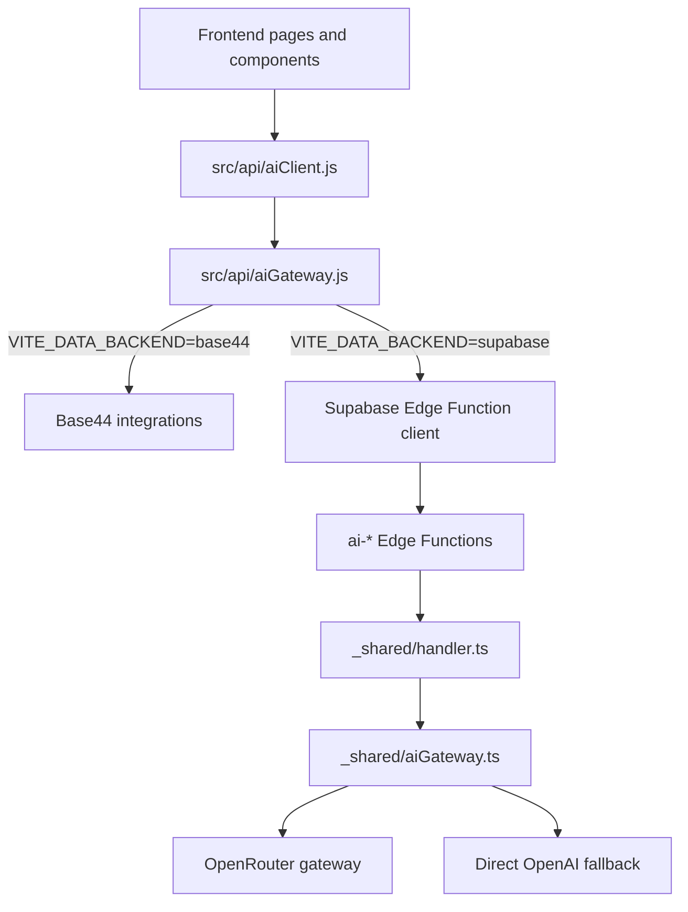

# Phase 7.6C — AI Gateway Migration Report

**Generated:** 2026-07-04  
**Scope:** provider-layer architecture only  
**Runtime default:** `VITE_DATA_BACKEND=base44` (unchanged)  
**Status:** `READY FOR PHASE 7.6D`

## Executive Summary

Phase 7.6C replaces the previous OpenAI-first server routing with an OpenRouter-first AI gateway while preserving:

- existing client prompts in `src/ai/prompts/`
- current frontend UI
- current backend runtime selection
- current Supabase schema, auth, storage, and RLS

The migration introduces a two-layer gateway shape:

1. `src/api/aiGateway.js` so app code flows `aiClient -> aiGateway`
2. `supabase/functions/_shared/aiGateway.ts` so every Supabase AI Edge Function uses the same provider routing, retry, fallback, and health model

No prompt engineering was rewritten in this phase.

## Files Updated

- `src/api/aiClient.js`
- `src/api/aiGateway.js`
- `supabase/functions/_shared/aiGateway.ts`
- `supabase/functions/_shared/provider.ts`
- `supabase/functions/_shared/handler.ts`
- `supabase/functions/ai-health/index.ts`
- `supabase/functions/ai-business-card/index.ts`
- `supabase/functions/ai-classify/index.ts`
- `supabase/functions/ai-document/index.ts`
- `supabase/functions/ai-match/index.ts`
- `supabase/functions/ai-recommend/index.ts`
- `supabase/functions/ai-summary/index.ts`
- `supabase/functions/README.md`

## New Architecture

## Provider Routing

### Primary gateway

- `AI_PROVIDER=openrouter`
- `OPENROUTER_API_KEY` is the primary secret

### Ordered route chain

When `AI_PROVIDER` is unset or set to `openrouter`, the shared gateway builds this route order:

1. DeepSeek via OpenRouter
2. Qwen via OpenRouter
3. Zhipu GLM via OpenRouter
4. Moonshot / Kimi via OpenRouter
5. OpenAI via OpenRouter
6. Claude via OpenRouter
7. Gemini via OpenRouter
8. Direct OpenAI fallback via `OPENAI_API_KEY` when present

### Compatibility behavior

- `OPENAI_API_KEY` remains supported
- legacy `AI_PROVIDER=openai` still works as a direct compatibility mode
- `provider.ts` now acts only as a backward-compatible re-export of `aiGateway.ts`

## Retry Strategy

Failover is handled centrally in `supabase/functions/_shared/aiGateway.ts`.

The gateway retries the next route when the current route fails with any of:

- timeout
- `429`
- `5xx`
- explicit provider-unavailable style errors
- network/unreachable conditions surfaced as provider-unavailable

### Retry flow

1. Build the route plan
2. Attempt the highest-priority enabled provider
3. Record attempt metadata
4. If error is retryable, move to the next enabled provider
5. Return the first successful completion
6. If all enabled routes fail, surface the final gateway error with attempt history

### Non-retryable failures

The gateway stops immediately for:

- authentication failures such as `401` or `403`
- configuration failures such as missing credentials with no remaining enabled routes
- non-retryable provider errors

## Fallback Behavior

### Request path

- successful requests return the actual selected provider and model
- response metadata now includes:
  - `gateway`
  - `fallbackProvider`
  - `attempts`

### Health path

`ai-health` now reports:

- `selectedProvider`
- `activeModel`
- `fallbackProvider`
- `latency`
- `providerHealth`
- `routing`
- `gateway`

The health probe checks gateway reachability and model visibility for the configured route chain. This gives operators a fast view of whether the preferred China-optimized route is available before traffic is switched to `VITE_DATA_BACKEND=supabase`.

## China Compatibility Assessment

### Why OpenRouter-first improves China fit

- The first four providers are China-relevant or China-adjacent model families: DeepSeek, Qwen, Zhipu, and Moonshot/Kimi.
- The route chain no longer assumes OpenAI as the first live dependency.
- If one provider is degraded, traffic can move laterally across other OpenRouter-accessible providers without changing the app contract.
- Prompt logic remains client-side, so provider substitution does not require product-level copy or UX rewrites.

### Expected strengths

- better odds of low-latency and region-tolerant inference when DeepSeek/Qwen/Zhipu/Moonshot are healthy
- lower dependence on a single US-first vendor
- faster operational recovery during provider-specific rate limits or outages

### Residual risks

- OpenRouter itself is still a gateway dependency, so cross-border network conditions still matter
- exact model availability can shift by region and OpenRouter catalog changes
- some fallback vendors, especially Claude and Gemini, remain less China-optimized than the primary four
- no weighted latency scoring or cost-based auto-routing is implemented yet; this phase uses deterministic priority order

### Overall assessment

**Assessment:** good architectural fit for a Mainland China-first rollout, with the main remaining operational dependency being OpenRouter availability itself.

## Estimated Token Cost Comparison

This section is intentionally **illustrative**, not contractual. Model catalogs and prices move quickly, and OpenRouter passes through model pricing with no inference markup, while credit purchases add a platform fee. The numbers below use representative public July 2026 references for comparable model families.

| Route family | Representative public model | Estimated input / 1M | Estimated output / 1M | Relative cost tier |
| --- | --- | ---: | ---: | --- |
| DeepSeek | DeepSeek V3 | $0.20 | $0.77 | Low |
| Qwen | Qwen3 235B | $0.46 | $1.82 | Low-Mid |
| Zhipu GLM | GLM-4.7 / GLM-4.5 class | $0.60 | $2.20 | Mid |
| Moonshot / Kimi | Kimi K2.5 | $0.60 | $3.00 | Mid |
| OpenAI fallback | GPT-4o Mini | $0.15 | $0.60 | Low |
| Claude fallback | Claude Sonnet 4.6 class | $3.00 | $15.00 | High |
| Gemini fallback | Gemini 2.5 Flash | $0.30 | $2.50 | Mid |

### Cost takeaways

- DeepSeek and Qwen are the best default value candidates for high-volume structured extraction and summarization.
- Zhipu and Moonshot remain materially cheaper than Claude-class fallbacks.
- Claude is the most expensive fallback in this chain and should be treated as a resilience/quality reserve, not the default path.
- Direct OpenAI fallback stays important for compatibility, but the new design prevents it from dominating default spend.

## Verification Notes

### Confirmed in code

- frontend calls now route through `src/api/aiGateway.js`
- Edge Functions now import the shared AI gateway abstraction
- the old provider module no longer owns provider logic
- `ai-health` exposes routing and provider-health details
- no `openai` references remain in `src/`

### Checks run

- `ReadLints` on edited files: no new lint issues found
- `npm run typecheck`: no errors remained in the files changed for Phase 7.6C
- `npm run lint`: repository has many unrelated pre-existing unused-import errors outside this phase

## Constraints Compliance

| Constraint | Result |
| --- | --- |
| Do not change frontend UI | Kept |
| Do not change backend runtime | Kept |
| Do not change Supabase schema | Kept |
| Do not change authentication | Kept |
| Do not change storage | Kept |
| Do not change RLS | Kept |
| Preserve prompts | Kept |
| Architecture-only phase | Kept |

## Recommendation

Phase 7.6C is complete as an architectural migration. The next phase should validate live credentials and real provider health in the target Supabase project before any runtime cutover.

`READY FOR PHASE 7.6D`
