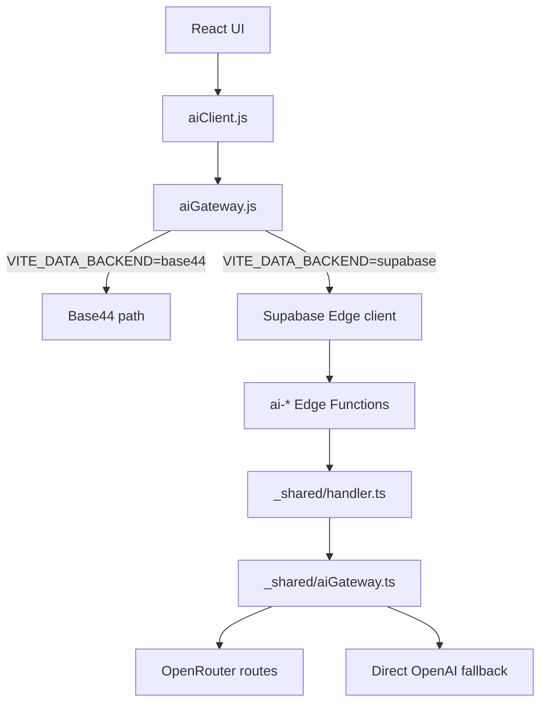

# Phase 7.6D — AI Gateway Validation & Failover Testing

**Generated:** 2026-07-04  
**Project:** BoothBridge  
**Branch:** `migration/base44-independence`  
**Scope:** validation only; no deploys, no runtime change, no database or schema changes

## Final Verdict

**STOP — Issues detected**

The OpenRouter-first gateway is largely working as intended for ordered failover, timeout recovery, and retry handling, but Phase 7.6D cannot fully sign off because:

1. `ai-health` does **not** expose a distinct `gateway version` field.
2. provider-selection "logging" exists only as response metadata on AI responses; there is **no explicit server-side logging call** in the gateway path.
3. the effective failover chain includes an extra hidden hop: **direct OpenAI after Gemini**, which is not reflected in the requested 7-provider sequence.
4. provider priority is currently hardcoded in `supabase/functions/_shared/aiGateway.ts`.

## Validation Method

Validation combined:

- direct code review of:
  - `src/api/aiGateway.js`
  - `src/api/aiClient.js`
  - `supabase/functions/_shared/aiGateway.ts`
  - `supabase/functions/_shared/handler.ts`
  - `supabase/functions/ai-health/index.ts`
- repository search for provider-name leakage into:
  - `src/api/aiClient.js`
  - `src/ai/prompts/**`
  - `supabase/functions/ai-*`
- local mocked execution of the real shared gateway module under Node with mocked `Deno.env` and mocked `fetch`

No deploys, runtime switches, or live provider calls were performed.

## Routing Diagram

## Review Findings

### 1. `aiGateway.js`

Validated:

- app code now routes through `aiClient -> aiGateway`
- `aiGateway.js` is transport-only and does not contain provider ordering logic
- runtime default remains `VITE_DATA_BACKEND=base44`

Assessment:

- passes abstraction requirement on the app side
- no direct provider-name logic leaked into the frontend gateway wrapper

### 2. `aiGateway.ts`

Validated:

- provider ordering is implemented in one place
- retryable errors include `429`, `5xx`, timeout, and provider-unavailable cases
- non-retryable auth failures stop the chain
- attempts record `provider`, `gateway`, `model`, `status`, `retryable`, and `latency`

Assessment:

- failover implementation is correct for the hardcoded route list
- route priority is hardcoded, not configuration-driven

## Provider Routing Logic

The implemented route plan is:

1. `deepseek` via OpenRouter
2. `qwen` via OpenRouter
3. `zhipu` via OpenRouter
4. `moonshot` via OpenRouter
5. `openai` via OpenRouter
6. `claude` via OpenRouter
7. `gemini` via OpenRouter
8. `openai` via direct OpenAI API

### Important note

The requested validation sequence ended at Gemini, but the code adds a final compatibility hop:

- direct `openai` fallback using `OPENAI_API_KEY`

This is useful for compatibility, but it means the **actual** failover chain is longer than the requested one.

## Tested Failover Sequence

### Scenario A: DeepSeek unavailable

Mocked result:

- `deepseek` returned `503`
- gateway failed over to `qwen`
- completion succeeded on `qwen`

Observed attempt order:

1. `deepseek/openrouter` -> fail
2. `qwen/openrouter` -> success

### Scenario B: Sequential failure through Gemini

Mocked failures:

- DeepSeek `503`
- Qwen `503`
- Zhipu `503`
- Moonshot `503`
- OpenAI via OpenRouter `503`
- Claude `503`

Observed result:

- `gemini/openrouter` succeeded

Observed attempt order:

1. `deepseek/openrouter`
2. `qwen/openrouter`
3. `zhipu/openrouter`
4. `moonshot/openrouter`
5. `openai/openrouter`
6. `claude/openrouter`
7. `gemini/openrouter`

### Scenario C: Direct OpenAI compatibility fallback

Mocked failures:

- all seven OpenRouter-backed routes failed with `503`

Observed result:

- final retry moved to direct `openai`
- `openai/openai` succeeded

Observed attempt order:

1. `deepseek/openrouter`
2. `qwen/openrouter`
3. `zhipu/openrouter`
4. `moonshot/openrouter`
5. `openai/openrouter`
6. `claude/openrouter`
7. `gemini/openrouter`
8. `openai/openai`

## Timeout Behavior

Validated with a mocked timeout on DeepSeek:

- request aborted after the configured timeout window
- error was normalized to `AI_TIMEOUT`
- status was surfaced as `504`
- retry moved automatically to Qwen
- Qwen succeeded

Assessment:

- timeout handling works
- timeout is treated as retryable

## Retry Behavior

### Retryable cases verified

- `503` provider unavailable -> retried
- `429` rate limit -> retried
- timeout / abort -> retried

### Non-retryable case verified

Mocked DeepSeek `401`:

- request stopped immediately
- no attempt was made against Qwen
- error surfaced as `AI_AUTHENTICATION`
- `retryable` was `false`

Assessment:

- retry behavior is correctly split between retryable and non-retryable errors

## Provider-Selection Logging

### What is present

The shared handler adds response metadata containing:

- `gateway`
- `fallbackProvider`
- `attempts`

This gives clients visibility into which route executed.

### What is missing

There is **no explicit server-side provider-selection log statement** such as:

- `console.log(...)`
- structured audit logging
- persistent event logging

Assessment:

- **client-visible metadata exists**
- **server-side logging is not implemented**

This is a validation failure for production observability if "logging" is expected to mean operator-visible logs rather than response metadata only.

## `ai-health` Validation

### Verified present

`ai-health` reports:

- `selectedProvider`
- `fallbackProvider`
- `activeModel`
- `latency`
- `providerHealth`
- `routing`
- `gateway`

### Verified missing

`ai-health` does **not** report:

- `gatewayVersion`

Assessment:

- health coverage is otherwise strong
- missing gateway version prevents full pass against the stated requirement

## Provider-Specific Logic Leak Check

Repository search confirmed no provider-name leakage in:

- `src/api/aiClient.js`
- `src/ai/prompts/**`
- `supabase/functions/ai-*`

Provider-specific logic remains centralized in:

- `supabase/functions/_shared/aiGateway.ts`

Assessment:

- passes isolation requirement

## Unsupported Cases

- no config-driven provider ordering; route priority is compiled into code
- no weighted routing by latency, health score, or cost
- no circuit breaker behavior; repeated failures will traverse the full chain each time
- no server-side provider-selection logging beyond response metadata
- no distinct `gatewayVersion` field in `ai-health`
- `AI_PROVIDER=openai` bypasses the OpenRouter-first chain entirely
- direct OpenAI compatibility fallback creates an eighth route not called out in the requested sequence

## Production Recommendations

1. Move provider priority, model mapping, and direct-fallback toggles into configuration instead of hardcoding them in `aiGateway.ts`.
2. Add `gatewayVersion` to `ai-health`, ideally from a constant or deploy metadata.
3. Add explicit structured server-side logs for selected provider, gateway, attempts, final status, and latency.
4. Consider a circuit breaker or temporary cooldown per failed provider to avoid walking the full chain on repeated outages.
5. Consider separate config for:
   - enabled providers
   - ordered priority
   - timeout per provider
   - whether direct OpenAI fallback is allowed after Gemini
6. Document the extra direct-OpenAI fallback explicitly so operators do not assume the chain ends at Gemini.
7. Add a small automated harness for the mocked failover cases so future route changes do not regress behavior.

## Final Verdict

The gateway implementation is **close** to production-ready from a failover standpoint. The ordered retry chain, timeout handling, and non-retryable auth cutoff all validated successfully. However, the phase does **not** fully satisfy the requested validation targets because `ai-health` is missing `gateway version`, provider-selection logging is only response metadata, and the effective route chain contains an extra undocumented direct OpenAI hop.

**STOP — Issues detected**
