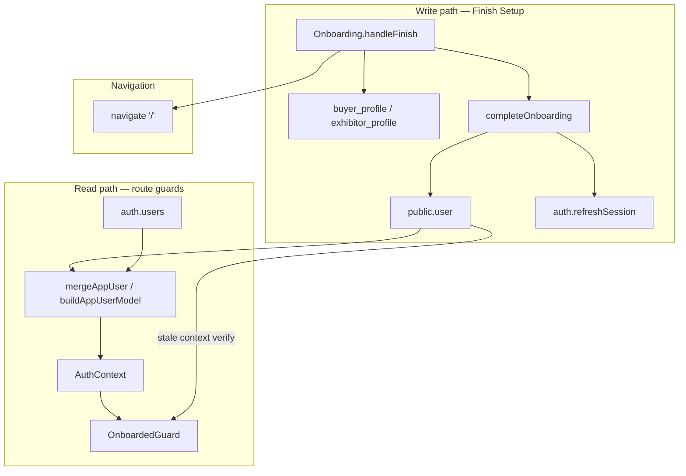
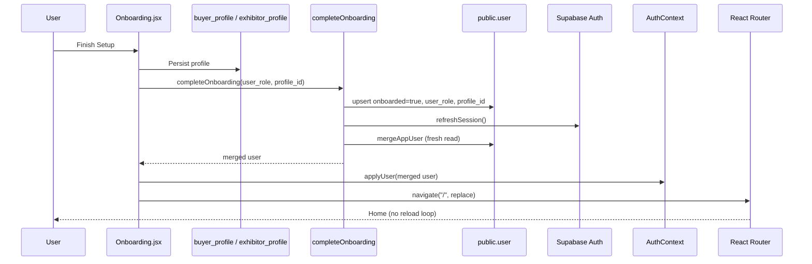

# RC10.7 — Onboarding Synchronization Report

**Date:** 2026-07-10  
**Scope:** Eliminate onboarding redirect race after Finish Setup; establish `public.user` as the single source of truth for onboarding state.

---

## Executive summary

The onboarding loop after Finish Setup was caused by **`mergeAppUser()` spreading stale `user_metadata` over authoritative `public.user` fields**. A full page reload via `window.location.href` amplified the issue by re-running auth bootstrap with JWT metadata that still held `onboarded: false`.

RC10.7 fixes this architecturally:

1. **`public.user`** is the only source of truth for `onboarded`, `user_role`, and `profile_id`.
2. **`completeOnboarding()`** persists profile state, refreshes the session, and returns a freshly merged user.
3. **`OnboardedGuard`** verifies against `public.user` before redirecting when context looks stale.
4. **React Router navigation** replaces hard reloads in onboarding and login flows.

---

## Part 1 — Dependency graph

### Write paths

| Location | Fields written | Target |
|----------|----------------|--------|
| `supabaseCompleteOnboarding()` | `user_role`, `onboarded`, `profile_id` | `public.user` only |
| `syncAppUserRow()` | same | `public.user` upsert |
| `Onboarding.jsx` `handleFinish` | buyer/exhibitor profile rows | `buyer_profile` / `exhibitor_profile` |
| `AdminUsers.jsx` | `user_role` (admin edit) | `public.user` via admin API |
| `supabaseRegister()` | `first_name`, `company`, etc. | `auth.users.user_metadata` (profile hints only) |

**Removed:** dual-write of onboarding fields to `auth.users.user_metadata` (was the staleness vector).

### Read paths

| Location | Fields read | Source |
|----------|-------------|--------|
| `mergeAppUser()` / `buildAppUserModel()` | `user_role`, `onboarded`, `profile_id` | `public.user` |
| `mergeAppUser()` | `role` (platform) | `auth.users.app_metadata.role` |
| `mergeAppUser()` | `first_name`, `company`, etc. | `auth.users.user_metadata` (onboarding keys stripped) |
| `OnboardedGuard` | onboarding gate | AuthContext → fallback `fetchAppUserOnboardingState()` |
| `Onboarding.jsx` mount guard | reverse gate | `getCurrentUser()` + DB verify |
| Page components (`Home`, `Profile`, etc.) | `user_role` | AuthContext (merged model) |
| `Profile.jsx` | profile body | `buyer_profile` / `exhibitor_profile` via `profile_id` |

### Dependency diagram



---

## Part 2 — Updated onboarding completion sequence



---

## Part 3 — OnboardedGuard behavior

| Step | Action |
|------|--------|
| 1 | Admin or impersonation → allow immediately |
| 2 | Context shows `onboarded && user_role` → allow |
| 3 | Context incomplete → query `public.user` directly |
| 4 | DB shows complete → `checkUserAuth({ silent })` then allow |
| 5 | DB confirms incomplete → redirect to `/onboarding` |
| 6 | While verifying → spinner (never redirect on stale context alone) |

---

## Part 4 — `mergeAppUser()` field sources

| Field | Source | Why |
|-------|--------|-----|
| `id`, `email` | `auth.users` | Canonical auth identity |
| `role` | `app_metadata.role` | Platform admin flag; server-controlled, RLS-safe |
| `user_role` | `public.user` | App role for routing/UI; mutable per onboarding |
| `onboarded` | `public.user` | Durable onboarding flag; must not live in JWT |
| `profile_id` | `public.user` | Polymorphic FK to buyer/exhibitor profile |
| `first_name`, `company`, etc. | `user_metadata` | Registration hints; not used for authorization |
| Profile body (company, booth, card) | `buyer_profile` / `exhibitor_profile` | Loaded by pages using `profile_id` |

**Removed redundancies:**

- No metadata fallback for `user_role` / `onboarded` / `profile_id`
- No `...meta` spread after authoritative fields (was overwriting correct DB values)
- No `auth.updateUser({ data: onboarding })` on completion

Implementation: `src/api/appUserModel.js` (`buildAppUserModel`, `extractProfileMetadata`).

---

## Part 5 — Hard refresh audit

| File | Before | After | Notes |
|------|--------|-------|-------|
| `Onboarding.jsx` | `window.location.href = "/"` | `navigate("/", { replace: true })` | **Fixed** — root cause amplifier |
| `Login.jsx` | `window.location.href = "/"` | `navigate` + `applyUser` | **Fixed** |
| `authClient.js` logout | `window.location.href` | unchanged | Full navigation intentional for session clear |
| `supabaseAuth.js` redirectToLogin | `window.location.href` | unchanged | Cross-route auth reset |
| `AppLayout.jsx` admin preview | `window.location.href` | unchanged | Impersonation mode switch (out of RC10.7 scope) |
| `AdminLogin.jsx` | `window.location.href` | unchanged | Admin shell entry |
| `ResetPassword.jsx` | `window.location.href` | unchanged | Post-reset login |
| `PageNotFound.jsx` | `window.location.href` | unchanged | 404 home link |
| `SentryErrorBoundary.jsx` | `location.reload()` | unchanged | Error recovery |

---

## Part 6 — Removed race conditions

| # | Race | Resolution |
|---|------|------------|
| 1 | `...meta` overwrote `public.user` onboarding fields in `mergeAppUser` | `buildAppUserModel` applies DB fields last; strips onboarding keys from metadata |
| 2 | `updateUser` fired `onAuthStateChange` before `public.user` sync | Onboarding fields no longer written to metadata; sync order in `completeOnboarding` |
| 3 | `window.location.href` re-bootstrap with stale JWT | React Router + `applyUser` with fresh merge |
| 4 | `OnboardedGuard` redirected on stale AuthContext alone | DB verification before redirect |
| 5 | Metadata/DB dual source of truth | `public.user` only for onboarding state |

---

## Validation report

### Automated

```bash
npm run validate:rc10-7-onboarding
```

Validates merge precedence, metadata stripping, and `isOnboardingComplete` helper.

### Manual regression checklist

| Flow | Expected | Status |
|------|----------|--------|
| Manual registration | Email sent, no onboarding loop | Manual |
| Email verification | Session created, onboarding if new | Manual |
| Login | SPA navigate to `/`, guard passes when onboarded | Manual |
| OCR onboarding | Profile saved, land on `/` without loop | Manual |
| Manual buyer onboarding | Same | Manual |
| Exhibitor onboarding | Same | Manual |
| Logout / login again | Onboarding state from `public.user` | Manual |
| Browser refresh on `/` | No redirect to onboarding when complete | Manual |
| Direct `/` | Onboarded users see dashboard | Manual |

### E2E (existing suite)

```bash
npm run test:e2e
```

Buyer/exhibitor setup projects use stored auth; route guard specs cover unauthenticated redirects.

---

## Files changed

| File | Change |
|------|--------|
| `src/api/appUserModel.js` | **New** — merge model + onboarding helpers |
| `src/api/supabaseAuth.js` | `completeOnboarding`, `fetchAppUserOnboardingState`, fixed merge |
| `src/api/authClient.js` | Public API exports |
| `src/lib/AuthContext.jsx` | `applyUser`, `refreshUser` |
| `src/components/OnboardedGuard.jsx` | **New** — DB-verified guard |
| `src/App.jsx` | Use shared guard component |
| `src/pages/Onboarding.jsx` | Completion flow + React Router |
| `src/pages/Login.jsx` | React Router navigation |
| `scripts/rc10-7-onboarding-validation.mjs` | **New** — merge validation |

**Schema changes:** None.
