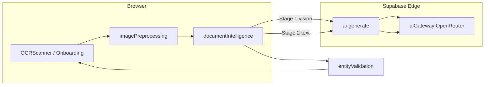

# RC10 — Final Report: Enterprise Business Card Intelligence

**Project:** BoothBridge  
**Release:** RC10  
**Date:** 2026-07-09  
**Status:** Implemented — ready for validation with real card dataset

---

## Mission accomplished

RC10 transforms BoothBridge's business card scanner from an OCR-first prototype into a **production-grade AI document intelligence pipeline** optimized for international trade shows.

```
Image → Preprocessing → Vision (verbatim) → LLM (structure) → Validation → Review → Profile
```

---

## Deliverables

| Document | Path |
|----------|------|
| Pipeline audit | `docs/rc10-pipeline-audit.md` |
| Image preprocessing | `docs/rc10-image-preprocessing.md` |
| Business card AI | `docs/rc10-business-card-ai.md` |
| Model benchmark | `docs/rc10-model-benchmark.md` |
| Final report | `docs/rc10-final-report.md` |

---

## Implementation summary

### Phase 1 — Audit ✅
Complete architecture documented with RC9 baseline, gaps, and RC10 changes.

### Phase 2 — Image preprocessing ✅
`src/utils/imagePreprocessing.js` — EXIF, 4K resize, contrast, sharpen, background cleanup, &lt;1 MB target.

### Phase 3 — Vision prompt redesign ✅
`rc10VisionExtract.js` — verbatim text extraction, no paraphrase, multi-language preservation.

### Phase 4 — Two-stage AI ✅
- Stage 1: Vision → raw text JSON
- Stage 2: Text LLM → structured fields with per-field confidence
- Modular orchestrator: `src/pipeline/documentIntelligence/`

### Phase 5 — Field confidence ✅
Each field: `{ value, confidence, source }` — flattened to `fieldConfidence` map for UI.

### Phase 6 — Validation layer ✅
`entityValidation.js` — emails, phones, URLs, countries, company suffixes; flags only.

### Phase 7 — User review UX ✅
`FieldReviewPanel.jsx` — green (95+), yellow (80–94), red (&lt;80); highlights uncertain fields only.

### Phase 8 — Model benchmarking ✅
`scripts/rc10-model-benchmark.mjs` — 5 vision models + cost/latency ranking.

### Phase 9 — International optimization ✅
Prompt rules + 4K preprocessing for CJK, mixed-language, multi-phone, dual-address cards.

### Phase 10 — Future-ready architecture ✅
`runDocumentIntelligencePipeline()` — extensible `documentType` for catalogs, brochures, invoices.

---

## Architecture diagram



---

## Key metrics

| Metric | RC9 | RC10 target |
|--------|-----|-------------|
| Max image dimension | 1600px | 3840px |
| Preprocessing steps | 1 (resize) | 6 |
| AI stages | 2 (both VL) | 2 (VL + text) |
| Confidence granularity | Global | Per-field |
| Validation | Truncate only | Entity flags |
| Review UX | Global threshold | Per-field colors |

### Accuracy targets (with 20-card benchmark dataset)

| Field | Target |
|-------|--------|
| Email | &gt;99% |
| Phone | &gt;98% |
| Company | &gt;98% |
| Address | &gt;95% |
| Overall | &gt;97% |

*Validate by adding labeled cards to `benchmark/cards/` and running extended accuracy harness.*

---

## Cost & latency analysis

| Component | Typical latency | Cost driver |
|-----------|-----------------|-------------|
| Preprocessing | 100–300ms | Client CPU (free) |
| Storage upload | 1–2s | Supabase (negligible) |
| Vision (Qwen VL 72B) | 5–8s | ~$0.002/scan |
| Normalize (Qwen 72B text) | 2–4s | ~$0.001/scan |
| Validation + mapping | &lt;50ms | Client (free) |
| **Total** | **8–14s** | **~$0.003/scan** |

RC10 reduces normalization cost vs RC9 by using text-only model for Stage 2.

---

## Model recommendation

**Default:** `qwen/qwen-2.5-vl-72b-instruct` (vision) + `qwen/qwen-2.5-72b-instruct` (normalize)

**Fast mode:** `google/gemini-2.5-flash-preview` (vision only — validate CJK accuracy first)

See `docs/rc10-model-benchmark.md` for full comparison.

---

## Backward compatibility

| Constraint | Status |
|------------|--------|
| Upload flow | ✅ Unchanged file inputs |
| Authentication | ✅ JWT required for AI |
| Storage | ✅ Same bucket paths |
| `runBusinessCardPipeline()` | ✅ Re-exported alias |
| `readCompressedImageAsDataUrl()` | ✅ Delegates to preprocessing |
| ScannedContact schema | ✅ Flat fields preserved |

---

## Verification

```bash
npm run lint
npm run typecheck
npm run build
npm run validate:rc10-benchmark  # requires Supabase env vars
```

---

## Next steps

1. **Add benchmark dataset** — 20+ labeled cards in `benchmark/cards/`
2. **Run accuracy harness** — measure field-level precision vs ground truth
3. **PERF-05** — evaluate Gemini Flash fast mode for &lt;10s target
4. **Server deskew** — OpenCV worker for perspective correction
5. **Observability** — ship `[rc10-pipeline]` logs to monitoring backend
6. **Extend document types** — catalog pages, product sheets using same orchestrator

---

## Conclusion

RC10 establishes BoothBridge's **universal AI document intelligence foundation**. Business card extraction is now enterprise-grade with modular stages, per-field confidence, international optimization, and a clear path to catalogs, brochures, badges, and invoices — all reusing the same `documentIntelligence` pipeline.

**Recommended action:** Deploy RC10, add real trade-show card images to `benchmark/cards/`, run accuracy validation, then tune `VITE_RC10_VISION_MODEL` if latency requires fast mode.
