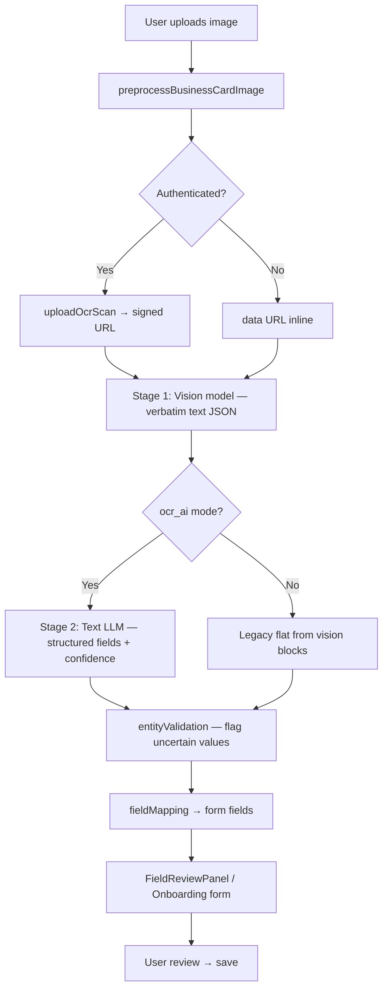

# RC10 — Pipeline Audit

**Date:** 2026-07-09  
**Scope:** Business card OCR → AI pipeline (pre-RC10 baseline + RC10 changes)

---

## Executive summary

RC9 delivered a working JWT-gated pipeline through `ai-generate` + Qwen 2.5 VL 72B. RC10 refactors this into a **modular document intelligence architecture** with enterprise preprocessing, two-stage AI, per-field confidence, validation flags, and improved review UX.

| Area | RC9 status | RC10 change |
|------|-----------|-------------|
| Image preprocessing | Canvas resize + JPEG 0.82 @ 1600px | EXIF, contrast, sharpen, background cleanup @ up to 3840px, &lt;1 MB |
| AI architecture | Single-pass vision + VL normalization | Stage 1 vision (verbatim text) → Stage 2 text LLM structure |
| Confidence | Global 0–100 | Per-field `{ value, confidence, source }` |
| Validation | `sanitizeOCRResult` truncation | Entity validation with flags (never rejects) |
| Review UX | Global threshold highlight | Green/yellow/red per field; only uncertain fields highlighted |
| Modularity | `businessCardPipeline.js` monolith | `documentIntelligence/` reusable orchestrator |

---

## Architecture (RC10)

Orchestrator: `src/pipeline/documentIntelligence/index.js`  
Backward-compatible alias: `src/pipeline/businessCardPipeline.js`

---

## Stage-by-stage audit

### 1. Upload flow

| Component | File | Notes |
|-----------|------|-------|
| OCR Scanner UI | `src/pages/OCRScanner.jsx` | Camera + gallery; RC10 FieldReviewPanel |
| Onboarding scan | `src/pages/Onboarding.jsx` | Post-auth buyer card scan |
| Pipeline entry | `runBusinessCardPipeline()` | Delegates to `runDocumentIntelligencePipeline()` |
| Storage upload | `src/utils/assetPipeline.js` → `uploadOcrScan()` | `boothbridge-ocr/scans/{userId}/` |
| Bucket policies | `supabase/migrations/094_storage_policies.sql` | Owner-scoped RLS |

### 2. Image preprocessing (RC10)

| Step | Implementation | File |
|------|----------------|------|
| EXIF orientation | `createImageBitmap({ imageOrientation: "from-image" })` | `src/utils/imagePreprocessing.js` |
| Resize | Up to 3840px longest edge (4K card readable) | same |
| Contrast | Histogram stretch on luminance | same |
| Background cleanup | Near-white pixel normalization | same |
| Sharpening | 3×3 unsharp mask convolution | same |
| Compression | JPEG quality 0.92 → 0.72 step, target &lt;1 MB | same |
| Metrics | `preprocessingMs`, `originalBytes`, `outputBytes`, `steps[]` | returned in `metrics.preprocessing` |

**RC9 bottleneck:** 1600px + aggressive quality reduction hurt small text on international cards.

### 3. Storage

| Item | Value |
|------|-------|
| Bucket | `boothbridge-ocr` |
| Path | `scans/{userId}/{filename}` |
| Signed URL TTL | 900s (15 min) |
| Client | `src/api/storageClient.js` |

### 4. OCR / Vision request (Stage 1)

| Item | RC9 | RC10 |
|------|-----|------|
| Edge function | `ai-generate` | `ai-generate` |
| Client API | `extractOcrScan()` | `extractRc10VisionText()` |
| Prompt | Generic field extraction | Verbatim text extraction only |
| Schema | Flat contact fields | `full_text`, `text_blocks`, `languages_detected` |
| Model | `qwen/qwen-2.5-vl-72b-instruct` | Configurable via `VITE_RC10_VISION_MODEL` |

Prompt: `src/ai/prompts/businessCard/rc10VisionExtract.js`

### 5. AI normalization (Stage 2)

| Item | RC9 | RC10 |
|------|-----|------|
| Client API | `normalizeBusinessCardProfile()` | `normalizeRc10BusinessCard()` |
| Input | Flat OCR JSON | Vision verbatim JSON |
| Output | Flat fields + global confidence | Per-field `{ value, confidence, source }` |
| Model | Same VL model | Text-only `qwen/qwen-2.5-72b-instruct` (faster, cheaper) |

Prompt: `src/ai/prompts/businessCard/rc10StructureNormalize.js`

### 6. JSON parsing

| Component | File |
|-----------|------|
| Safe parse | `safeJsonParse()` in `securitySanitizer.js` |
| Pipeline extract | `extractStructuredResult()` in `documentIntelligence/index.js` |
| Sanitize | `sanitizeOCRResult()` — truncation + injection strip |

### 7. Validation layer (RC10)

| Validator | Fields | Behavior |
|-----------|--------|----------|
| Email regex | email, secondary_email | Flag uncertain, lowercase normalize |
| Phone regex | phone, mobile, fax, whatsapp | Flag uncertain |
| URL regex | website, linkedin | Flag uncertain |
| Postal code | postal_code | Flag uncertain |
| Country aliases | country | Normalize common abbreviations |
| Company suffix | company_name | Flag very short names |

File: `src/pipeline/documentIntelligence/entityValidation.js`

### 8. Field mapping

| Target | Mapper | Output |
|--------|--------|--------|
| Onboarding | `mapToRegistrationFields()` | camelCase + `fieldConfidence` |
| Scanner | `mapToOcrScannerFields()` | snake_case + extended RC10 fields |

File: `src/pipeline/fieldMapping.js`

### 9. UI rendering

| Screen | Component | RC10 behavior |
|--------|-----------|---------------|
| OCR Scanner review | `FieldReviewPanel` | Per-field confidence colors; only &lt;95% highlighted |
| Onboarding step 4 | Inline inputs | `fieldBorderClass()` green/yellow/red |
| Confirmation gate | Checkbox | Required only when uncertain fields exist |

### 10. Pipeline logging

| Tag | Stages |
|-----|--------|
| `[rc10-pipeline]` | preprocessing, storage_upload, vision_extraction, ai_normalization, field_mapping |

File: `src/pipeline/pipelineLogger.js`

---

## OpenRouter / Edge gateway

| Setting | Value |
|---------|-------|
| Gateway | OpenRouter (default) |
| Production vision | `qwen/qwen-2.5-vl-72b-instruct` |
| Production normalize | `qwen/qwen-2.5-72b-instruct` |
| Temperature | 0.2 |
| Timeout | 30s default (max 60s) |
| Gateway file | `supabase/functions/_shared/aiGateway.ts` |

---

## Gaps closed by RC10

1. **Dual phone fields** — separate `phone` + `mobile` mapping
2. **Address missing** — `address` in RC10 schema + registration mapping
3. **Global confidence useless** — per-field confidence drives UX
4. **VL model for text normalization** — offloaded to text-only model
5. **OCRScanner `fieldErrors` bug** — `useState` added
6. **Low-res preprocessing** — 4K-capable pipeline with quality-first compression

## Remaining gaps (post-RC10)

1. **PERF-05** (&lt;10s) — two AI calls may still exceed on slow networks; monitor with `metrics`
2. **Server-side preprocessing** — all client-side; consider edge image worker for deskew/perspective
3. **Benchmark dataset** — add 20+ real cards to `benchmark/cards/` for accuracy measurement
4. **Observability** — pipeline logs still console-only; ship to Datadog/Sentry
5. **Legacy paths** — `ai-business-card`, `extractBusinessCard()` still present but unused

---

## File inventory

### RC10 new/modified
- `src/utils/imagePreprocessing.js`
- `src/pipeline/documentIntelligence/index.js`
- `src/pipeline/documentIntelligence/entityValidation.js`
- `src/ai/prompts/businessCard/rc10VisionExtract.js`
- `src/ai/prompts/businessCard/rc10StructureNormalize.js`
- `src/components/ocr/FieldReviewPanel.jsx`
- `scripts/rc10-model-benchmark.mjs`

### Unchanged integration points
- `src/api/aiClient.js` — extended, not replaced
- `src/api/supabaseAi.js` — unchanged
- `supabase/functions/ai-generate/` — unchanged
- Storage buckets / auth — unchanged
