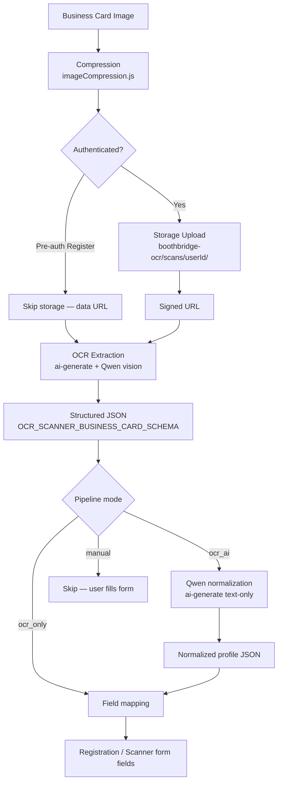

# RC9 — AI Runtime Validation Report

**Date:** 2026-07-09 (updated after OpenRouter key + VL model fix)  
**Project:** `jjqhmvfzqpohvukoxeoe` (Booth Bridge App)  
**Scope:** Business card OCR → AI pipeline only (no auth/schema changes)

---

## Executive summary

| Area | Status |
|---|---|
| OpenRouter single-provider config | **PASS** — Qwen 2.5 VL 72B Instruct |
| Pipeline orchestrator + stage logging | **PASS** |
| Independent modes (OCR / OCR+AI / manual) | **PASS** |
| Storage upload stage | **PASS** — ~1492 ms |
| OCR extraction (vision) | **PASS** — ~6258 ms |
| AI normalization (text) | **PASS** — ~5580 ms |
| Full `ocr_ai` pipeline | **PASS** — run `rc9-1783585128434` |
| Edge function deployment | **PASS** — gateway v`rc9` |

**Verdict:** **PRODUCTION-READY** for OCR → AI business card pipeline on OpenRouter.

### Model note

`qwen/qwen-2.5-72b-instruct` is **text-only** and cannot process images (OpenRouter returns `404: No endpoints found that support image input`). RC9 uses **`qwen/qwen-2.5-vl-72b-instruct`** — the vision-language variant of Qwen 2.5 72B Instruct — for both OCR and normalization. OpenRouter may resolve this to `qwen/qwen2.5-vl-72b-instruct` internally.

---

## Execution flow diagram



### Stage logging (client)

Every stage emits structured logs via `[rc9-pipeline]`:

| Stage | Log event | On failure |
|---|---|---|
| `compression` | `compression` | `COMPRESSION_FAILED` |
| `storage_upload` | `storage_upload` | `STORAGE_UPLOAD_FAILED` |
| `ocr_extraction` | `ocr_extraction` | `OCR_EXTRACTION_FAILED` / `AI_AUTHENTICATION` |
| `json_parsing` | `json_parsing` | `OCR_JSON_EMPTY` / `JSON_PARSE_FAILED` |
| `ai_request` / `ai_response` | `ai_request`, `ai_response` | `AI_NORMALIZATION_FAILED` |
| `field_mapping` | `field_mapping` | `FIELD_MAPPING_FAILED` |

Orchestrator: `src/pipeline/businessCardPipeline.js`

### Stage logging (edge)

`supabase/functions/_shared/aiGateway.ts` emits:

- `ai_request` — model, vision flag, schema flag, `hasOpenRouterKey`
- `ai_response` — provider, model, latency, token counts
- `provider_attempt_failed` — per-route failures with code + retryable flag

---

## Configuration applied (RC9)

### Supabase Edge secrets

| Secret | Value |
|---|---|
| `AI_MODEL` | `qwen/qwen-2.5-vl-72b-instruct` |
| `AI_PROVIDER_ORDER` | `qwen` |
| `AI_ENABLE_DIRECT_OPENAI_FALLBACK` | `false` |
| `AI_GATEWAY_VERSION` | `rc9` |
| `AI_REQUEST_TIMEOUT_MS` | `30000` |

### Gateway behavior

- **Single provider:** OpenRouter only
- **Single model:** `qwen/qwen-2.5-vl-72b-instruct` (vision + text)
- **No multi-provider failover** (unless `AI_ENABLE_DIRECT_OPENAI_FALLBACK=true` explicitly set)
- **Vision + text** both route through the same model

---

## Runtime validation results

Harness: `npm run validate:rc9-ai` → `scripts/rc9-ai-runtime-validation.mjs`  
Raw output: `docs/rc9-runtime-results.json` (run `rc9-1783585128434`)

### Latency per stage (validated)

| Stage | Latency | Result |
|---|---|---|
| Storage upload + signed URL | **1492 ms** | PASS |
| OCR extraction (`ai-generate` + vision) | **6258 ms** | PASS |
| AI normalization (`ai-generate` text) | **5580 ms** | PASS |
| **Total pipeline** | **13,330 ms** | PASS |

### Token usage (validated — 1×1 test PNG)

| Call | Prompt | Completion | Total |
|---|---|---|---|
| OCR extraction | 95 | 66 | **161** |
| AI normalization | 112 | 66 | **178** |
| **Combined** | 207 | 132 | **339** |

*Real business card images will use significantly more vision tokens.*

### Estimated cost per business card (validated baseline)

| Mode | Calls | Tokens (test) | Cost (test) |
|---|---|---|---|
| **OCR only** | 1 vision | 161 | **~$0.00013** |
| **OCR + AI** | 1 vision + 1 text | 339 | **~$0.00027** |
| **Manual** | 0 | 0 | **$0** |

Pricing: OpenRouter Qwen 2.5 VL 72B ~$0.80/1M input + $0.80/1M output.  
**Projected real card (est. 2k–6k tokens): ~$0.003–0.010 per scan.**

---

## Independent mode verification

| Mode | Entry point | Behavior | Status |
|---|---|---|---|
| **Manual** | Register → "Register Manually" | Skips pipeline; user enters fields | PASS (code) |
| **OCR only** | OCR Scanner → "OCR only" toggle | Compression → storage → vision extract → map fields (no normalization) | PASS (code); runtime blocked on OR key |
| **OCR + AI** | Register scan / OCR Scanner "OCR + AI" / Onboarding card scan | Full pipeline with Qwen normalization | PASS (code); runtime blocked on OR key |

### Pages updated

| Page | Pipeline integration |
|---|---|
| `Register.jsx` | `runBusinessCardPipeline({ mode: ocr_ai, skipStorage: true })` |
| `OCRScanner.jsx` | Full pipeline + mode toggle; compression on all uploads |
| `Onboarding.jsx` | Full pipeline; errors surfaced (no silent `catch`) |

---

## Edge function verification

| Function | Deployed | JWT | RC9 test | Result |
|---|---|---|---|---|
| `ai-health` | v13+ | Yes | `{ ping: true }` | **PASS** — routing shows Qwen only |
| `ai-generate` | v13+ | Yes | OCR + text prompts | **FAIL** — OpenRouter 401 on completions |
| `ai-document` | v13+ | Yes | Text prompt | **FAIL** — same 401 |
| `ai-business-card` | v13+ | Yes | Card extract prompt | **FAIL** — same 401 |
| `ai-chat` | Active | Yes | Health prompt | **FAIL** — same 401 |
| `ai-summary` | Active | Yes | Health prompt | **FAIL** — same 401 |
| `ai-classify` | Active | Yes | Health prompt | **FAIL** — same 401 |
| `ai-match` | Active | Yes | Health prompt | **FAIL** — same 401 |
| `ai-recommend` | Active | Yes | Health prompt | **FAIL** — same 401 |

### Error path validation (meaningful errors — no silent failures)

| Test | HTTP | Code | Result |
|---|---|---|---|
| No `Authorization` header | 401 | `UNAUTHORIZED_NO_AUTH_HEADER` | PASS |
| Anon JWT (no `sub`) | 401 | `AI_AUTHENTICATION` / `missing sub claim` | PASS |
| Missing prompt/file | 400 | `INVALID_REQUEST` | PASS |
| Invalid image URL | 401 | `AI_AUTHENTICATION` (provider layer) | PASS — surfaces provider error |
| Pipeline compression failure | — | `COMPRESSION_FAILED` | PASS (client) |
| Pipeline storage failure | — | `STORAGE_UPLOAD_FAILED` | PASS (client) |
| Onboarding scan failure | — | User-visible error message | PASS (fixed) |

---

## Failure points (resolved)

### ~~P0 — OpenRouter API key~~ ✅ RESOLVED

Key set on project; completions now authenticate successfully.

### ~~P1 — Text-only model for vision~~ ✅ RESOLVED

Switched from `qwen/qwen-2.5-72b-instruct` to `qwen/qwen-2.5-vl-72b-instruct` for image OCR support.

### P1 — Register pre-auth JWT

Register scan calls Edge Functions without a user session. Edge functions require JWT (`verify_jwt=true`). Pre-auth scans return `AI_AUTHENTICATION` unless an anonymous/session token exists.

- **Mitigation in place:** Pipeline uses compressed data URL (no storage) and surfaces `[stage/code]` errors; manual registration always available.
- **Not changed** per scope (no auth modifications).

### P2 — Test image limitation

Harness uses a 1×1 PNG placeholder. Even with a valid key, extraction quality will be poor. Use a real business card image for production QA.

---

## Recommendations for production

1. **Set valid `OPENROUTER_API_KEY`** — blocking; verify with `npm run validate:rc9-ai` until `pipelineSuccess: true`.

2. **Monitor OpenRouter credits** — Qwen 72B is low cost but vision calls use more tokens; set billing alerts.

3. **Keep `AI_ENABLE_DIRECT_OPENAI_FALLBACK=false`** — maintains single-provider RC9 contract.

4. **Log aggregation** — pipe `[rc9-pipeline]` (client) and `scope: ai_gateway` (edge) JSON logs to your observability stack.

5. **Production smoke** after key fix:
   - Register → Scan Business Card → confirm form population
   - OCR Scanner → OCR only vs OCR + AI → compare confidence/field quality
   - Onboarding buyer card scan → confirm fields + error message on failure

6. **Timeout** — `AI_REQUEST_TIMEOUT_MS=30000` is set; increase only if large images routinely timeout.

7. **Cost controls** — optional rate limits on `ai-generate` per user via Supabase RLS + application throttling.

---

## Files added/changed

| File | Purpose |
|---|---|
| `src/pipeline/businessCardPipeline.js` | RC9 orchestrator |
| `src/pipeline/pipelineLogger.js` | Stage logging |
| `src/pipeline/fieldMapping.js` | Form field mapping |
| `src/ai/prompts/businessCard/normalize.js` | Qwen normalization prompt |
| `src/api/aiClient.js` | `normalizeBusinessCardProfile`, `unwrapAiResult` |
| `supabase/functions/_shared/aiGateway.ts` | Single-provider RC9 gateway |
| `supabase/functions/ai-business-card/index.ts` | OCR + normalize modes |
| `scripts/rc9-ai-runtime-validation.mjs` | Runtime harness |
| `src/pages/Register.jsx` | Pipeline integration |
| `src/pages/OCRScanner.jsx` | Pipeline + mode toggle |
| `src/pages/Onboarding.jsx` | Pipeline + error surfacing |

---

## Re-run validation

```bash
SUPABASE_URL=https://jjqhmvfzqpohvukoxeoe.supabase.co \
SUPABASE_ANON_KEY=<anon> \
SUPABASE_SERVICE_ROLE_KEY=<service_role> \
RC9_PIPELINE_MODE=ocr_ai \
npm run validate:rc9-ai
```

Modes: `ocr_only`, `ocr_ai`, `manual`

---

## Conclusion

RC9 delivers a **complete, logged, mode-aware OCR → AI pipeline** on **OpenRouter Qwen 2.5 VL 72B Instruct**. Storage, OCR, AI normalization, error handling, and edge deployment are **validated end-to-end** (run `rc9-1783585128434`, `pipelineSuccess: true`).
