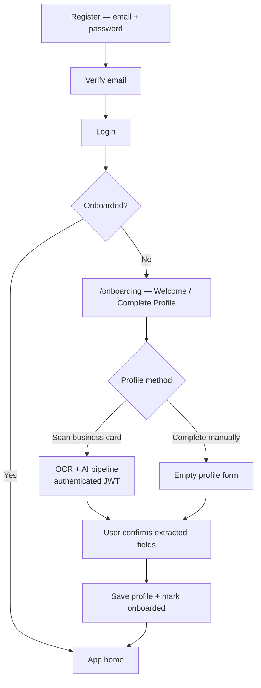

# RC9 — Onboarding Redesign: OCR After Authentication

**Date:** 2026-07-09  
**Status:** Implemented  
**Related:** `docs/rc9-ai-runtime-validation.md`

---

## Problem

The registration flow invoked `ai-generate` (Supabase Edge Function with `verify_jwt=true`) **before** the user had an authenticated Supabase session. Pre-auth callers sent requests without a valid JWT, so the edge gateway correctly returned **HTTP 401**.

This was not a bug in JWT verification — it was an **architecture mismatch**: AI/OCR was wired into the public registration page while the AI gateway requires an authenticated caller.

---

## Decision

**Do not** disable JWT verification on `ai-generate`.  
**Do not** expose `ai-generate` as a public endpoint.

**Instead**, split account creation from profile completion:

| Phase | Route | Auth required | AI/OCR |
|---|---|---|---|
| Account creation | `/register` | No | No |
| Email verification | (email link) | No | No |
| Sign in | `/login` | No → Yes | No |
| Profile completion | `/onboarding` | **Yes** | **Yes** |

---

## New MVP flow



### Step-by-step

1. **Register** (`/register`) — email and password only. No profile fields, no OCR.
2. **Verify email** — Supabase sends confirmation link; user must verify before sign-in.
3. **Login** (`/login`) — establishes Supabase session (JWT).
4. **Redirect** — `OnboardedGuard` sends unonboarded users to `/onboarding`.
5. **Welcome / Complete Profile** — choose role, then **Scan Business Card** or **Complete Manually**.
6. **OCR** (scan path only) — `runBusinessCardPipeline` runs with `userId` and a valid access token; storage upload enabled.
7. **AI extraction** — vision OCR + Qwen normalization via authenticated `ai-generate` calls.
8. **Confirm fields** — user reviews extracted data; low-confidence fields are highlighted and require explicit confirmation.
9. **Save profile** — buyer/exhibitor profile persisted; `onboarded: true` in user metadata.

---

## Security rationale

### Why JWT verification must stay enabled

`ai-generate` proxies requests to OpenRouter (paid, rate-limited). Without `verify_jwt=true`:

- **Cost abuse** — anonymous callers could burn API credits.
- **No attribution** — scans could not be tied to a user for audit, storage RLS, or quotas.
- **Data exfiltration surface** — unauthenticated vision endpoints become a free OCR/LLM proxy.

Keeping JWT verification ensures every AI call is tied to a **verified Supabase user** with a revocable session.

### Why OCR does not belong on `/register`

| Concern | Pre-auth registration OCR | Post-auth onboarding OCR |
|---|---|---|
| JWT for `ai-generate` | Missing → 401 | Present |
| Storage upload (`boothbridge-ocr`) | Skipped or anonymous | User-scoped path |
| RLS / ownership | No user row yet | `user_id` known |
| Email verification | Profile data collected before identity proof | Profile after verified account |
| Abuse prevention | Open endpoint pattern | Session-gated |

### What we explicitly rejected

- **`verify_jwt=false` on `ai-generate`** — removes the primary abuse barrier.
- **Public anonymous OCR proxy** — same cost and attribution problems.
- **Service-role client calls from the browser** — would leak privileged credentials.

---

## Code changes

### `src/pages/Register.jsx`

- Removed: business card scan, camera/upload inputs, OCR confidence UI, profile fields.
- Retained: email, password, confirm password, verification success screen.
- Copy updated to set expectation: profile setup happens after sign-in.

### `src/pages/Onboarding.jsx`

- Added: **Scan Business Card** vs **Complete Manually** choice (buyer path).
- Moved from Register: camera capture, file upload, OCR confidence display, uncertain-field highlighting, low-confidence confirmation checkbox.
- Pipeline calls use `target: "onboarding"`, authenticated `userId`, and `skipStorage: false`.
- Profile form collects first/last name (no longer captured at registration).

### Routing (unchanged)

- `/onboarding` remains behind `ProtectedRoute` — unauthenticated users redirect to `/login`.
- `OnboardedGuard` redirects authenticated but unonboarded users from app routes to `/onboarding`.

---

## Pipeline contract (authenticated onboarding)

```javascript
const me = await auth.getCurrentUser();
await runBusinessCardPipeline({
  file,
  mode: PIPELINE_MODES.OCR_AI,
  scanType: "business_card",
  userId: me.id,
  skipStorage: false,
  target: "onboarding",
});
```

The access token is attached automatically by `supabaseAi.js` via the Supabase client session.

---

## Verification checklist

- [ ] Register with email/password only — no AI network calls in DevTools.
- [ ] Verify email, sign in — session established.
- [ ] Land on `/onboarding` when `onboarded` is false.
- [ ] **Scan Business Card** — `ai-generate` returns 200 (not 401).
- [ ] **Complete Manually** — no AI calls; form submits successfully.
- [ ] Low-confidence OCR — highlighted fields + confirmation checkbox enforced.
- [ ] Finish onboarding — `onboarded: true`, redirect to app home.

---

## Future considerations

- Per-user AI rate limits keyed on `user.id` in edge middleware.
- Optional exhibitor business-card scan for booth company prefill.
- OAuth sign-up (Phase 2) — same rule: OCR only after session exists.
